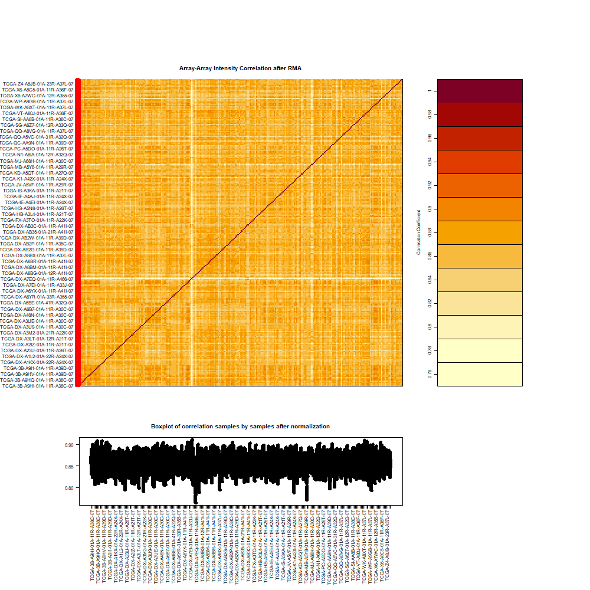

```{r library, include=FALSE}

try(Sys.setlocale("LC_CTYPE", "English_United States.UTF-8"), silent = TRUE)


load_or_install <- function(pkg, bioc = FALSE) {
  if (!requireNamespace(pkg, quietly = TRUE)) {
    if (bioc) {
      if (!requireNamespace("BiocManager", quietly = TRUE)) {
        install.packages("BiocManager", repos = "https://cloud.r-project.org")
      }
      BiocManager::install(pkg, ask = FALSE, update = FALSE)
    } else {
      install.packages(pkg, repos = "https://cloud.r-project.org")
    }
  }
  suppressPackageStartupMessages(library(pkg, character.only = TRUE))
}


cran_packages <- c(
  "readxl", "ggplot2", "tidyverse", "dplyr",
  "viridis", "RColorBrewer", "ggpubr", "rstatix",
  "plotly", "ggforce", "ggrepel", "DT", "shiny","colorspace"
)


bioc_packages <- c("TCGAbiolinks", "SummarizedExperiment")


for (pkg in cran_packages) load_or_install(pkg, bioc = FALSE)
for (pkg in bioc_packages) load_or_install(pkg, bioc = TRUE)

```

[Wish to go back to index ?](https://joeydufourd.github.io/)

Welcome to this large-scale RMarkdown re-analysis.
For now, I’ve kept the code in its full form rather than refactoring into functions. This keeps the workflow transparent, though function-based simplification may be added later.
The entire repository is fully reproducible via the 'renv.lock' file.
Below, you’ll also find my session information for reference:
```{r}
sessionInfo()
```

This page is an interactive document generated from RMarkdown analyses. You can click on the graphs to explore the data, filter the tables, and navigate by histological type using the tabs. For technical details, see the source code available on GitHub.

---

The Kaplan–Meier curves presented here show overall survival according to the expression of genes of interest (TELS1, TRF2, ATRX/DAXX). The p-values are derived from log-rank tests. The results should be interpreted with caution given the size of the cohorts.

---

The color palette used throughout this document is cividis, a perceptually uniform colormap designed to be accessible for readers with color vision deficiencies. Unlike traditional palettes (e.g., “Red–Yellow–Blue”), cividis ensures consistent contrasts across the full range of values, remains interpretable when printed in grayscale, and improves accessibility of figures for a broader audience.

# An analysis of TELS1 (and others) GDCdata {.tabset}

## Every histological type

```{r, echo=FALSE, results='hide', message=FALSE, warning=FALSE}
data.dir <- "./GDCdata/TCGA-SARC/Clinical"
dir.create(data.dir, recursive = TRUE, showWarnings = FALSE)

clinical.file <- file.path(data.dir, "clinical.rds")
if (!file.exists(clinical.file)) {
  message("Downloading clinical tables...")
  clinical <- GDCquery_clinic(project = "TCGA-SARC", type = "clinical")
  saveRDS(clinical, clinical.file)
} else {
  message("Loading clinical tables from cache...")
  clinical <- readRDS(clinical.file)
}

supp.file <- file.path(data.dir, "clinical_supp.rds")
if (!file.exists(supp.file)) {
  message("Downloading clinical supplements (XML)...")
  query_supp <- GDCquery(
    project = "TCGA-SARC",
    data.category = "Clinical",
    data.type = "Clinical Supplement",
    data.format = "BCR XML"
  )
  GDCdownload(query_supp, directory = data.dir)
  clinical.supp <- GDCprepare_clinic(query_supp,
                                     clinical.info = "patient",
                                     directory = data.dir)
  saveRDS(clinical.supp, supp.file)
} else {
  message("Loading clinical supplements from cache...")
  clinical.supp <- readRDS(supp.file)
}

```

```{r, echo=TRUE, message=FALSE, warning=FALSE,fig.align='center'}
colnames(clinical.supp)[colnames(clinical.supp) == "bcr_patient_barcode"] <- "submitter_id"
merged_clinical <- dplyr::full_join(clinical, clinical.supp, by = "submitter_id") %>%
  dplyr::rename(
    vital_status = vital_status.x,
    days_to_death = days_to_death.x,
  )
data.stage2 <- merged_clinical

DT::datatable(
  data.stage2,
  filter = "top",
  options = list(scrollX = TRUE, pageLength = 5, autoWidth = TRUE),
  rownames = FALSE
)
```

```{r, echo=TRUE, message=FALSE, warning=FALSE}
ggplotly(ggplot(data.stage2)+aes(x=vital_status,fill=vital_status)+geom_bar()+labs(fill="Vital Status", x="Vital Status", y= "Count")+theme_bw()+scale_fill_viridis_d(option = "cividis")+theme(panel.grid.major = element_blank(), panel.grid.minor =element_blank()))
```

```{r, echo=FALSE, results='hide', message=FALSE, warning=FALSE}

rna.dir <- "GDCdatasarcRNA2"
rna.file <- file.path(rna.dir, "rna_data.rds")

if (!file.exists(rna.file)) {
  message("Querying and downloading RNA expression data...")

  queryRNA <- GDCquery(
    project = "TCGA-SARC",
    data.category = "Transcriptome Profiling",
    data.type = "Gene Expression Quantification",
    workflow.type = "STAR - Counts",
    sample.type = "Primary Tumor"
  )

  GDCdownload(queryRNA, directory = rna.dir, method = "api", files.per.chunk = 5)
  data.rna <- GDCprepare(queryRNA, directory = rna.dir)

  saveRDS(data.rna, rna.file)

} else {
  message("Loading RNA data from cache...")
  data.rna <- readRDS(rna.file)
}

RNA <- assay(data.rna)
RNAoutliers <- TCGAanalyze_Preprocessing(data.rna)
```

### Sample–sample correlation heatmap



### ACTA2 expression as a lineage control

```{r, echo=TRUE, message=FALSE, warning=FALSE}
library(edgeR)

dge <- DGEList(counts = RNA)
dge <- calcNormFactors(dge)
RNA_norm <- cpm(dge, log = TRUE)

RNA_norm <- cpm(dge, log = TRUE)

lms_patients <- data.stage2$submitter_id
RNA_norm <- RNA_norm[, substr(colnames(RNA_norm), 1, 12) %in% lms_patients]

ACTA2 <- RNA_norm["ENSG00000107796.13", , drop = FALSE] |>
  t() |>
  as.data.frame()
colnames(ACTA2) <- "ACTA2_expr"
ACTA2$patient <- substr(rownames(ACTA2), 1, 12)

ACTA2$ACTA2_group <- ifelse(ACTA2$ACTA2_expr <= median(ACTA2$ACTA2_expr),
                            "Low", "High")
ACTA2 <- ACTA2[!duplicated(ACTA2$patient), ]

clin_sub <- data.stage2[, c("submitter_id", "vital_status")]
merged <- dplyr::left_join(ACTA2, clin_sub,
                           by = c("patient" = "submitter_id"))

p1 <- ggplot(ACTA2, aes(x = "", y = ACTA2_expr, fill = "ACTA2")) +
  geom_boxplot() +
  labs(fill = "ACTA2 RNA (log2 CPM)", x = "", y = "log2 CPM") +
  theme_bw() +
  scale_fill_viridis_d(option = "cividis") +
  theme(panel.grid.major = element_blank(),
        panel.grid.minor = element_blank())

p3 <- ggplot(merged, aes(x = ACTA2_group, fill = vital_status)) +
  geom_bar(position = "fill") +
  labs(fill = "Vital Status", x = "ACTA2 Expression", y = "Frequency") +
  theme_bw() +
  scale_fill_viridis_d(option = "cividis") +
  theme(panel.grid.major = element_blank(),
        panel.grid.minor = element_blank())

ggplotly(p1)
ggplotly(p3)

```

### DAXX expression as a lineage control

```{r, echo=TRUE, message=FALSE, warning=FALSE}
DAXX <- RNA_norm["ENSG00000204209.13", , drop = FALSE] |>
  t() |>
  as.data.frame()
colnames(DAXX) <- "DAXX_expr"
DAXX$patient <- substr(rownames(DAXX), 1, 12)

DAXX$DAXX_group <- ifelse(DAXX$DAXX_expr <= median(DAXX$DAXX_expr),
                            "Low", "High")
DAXX <- DAXX[!duplicated(DAXX$patient), ]

clin_sub <- data.stage2[, c("submitter_id", "vital_status")]
merged <- dplyr::left_join(DAXX, clin_sub,
                           by = c("patient" = "submitter_id"))

p1 <- ggplot(DAXX, aes(x = "", y = DAXX_expr, fill = "DAXX")) +
  geom_boxplot() +
  labs(fill = "DAXX RNA (log2 CPM)", x = "", y = "log2 CPM") +
  theme_bw() +
  scale_fill_viridis_d(option = "cividis") +
  theme(panel.grid.major = element_blank(),
        panel.grid.minor = element_blank())

p3 <- ggplot(merged, aes(x = DAXX_group, fill = vital_status)) +
  geom_bar(position = "fill") +
  labs(fill = "Vital Status", x = "DAXX Expression", y = "Frequency") +
  theme_bw() +
  scale_fill_viridis_d(option = "cividis") +
  theme(panel.grid.major = element_blank(),
        panel.grid.minor = element_blank())

ggplotly(p1)
ggplotly(p3)

```

### DAXX & ATRX expression as a lineage control

```{r, echo=TRUE, message=FALSE, warning=FALSE}

genes <- c("ENSG00000085224.23",
           "ENSG00000204209.13")

atrx_daxx <- RNA_norm[genes, , drop = FALSE] |>
  t() |>
  as.data.frame()

colnames(atrx_daxx) <- c("ATRX_expr", "DAXX_expr")
atrx_daxx$patient <- substr(rownames(atrx_daxx), 1, 12)

atrx_daxx$ATRX_group <- ifelse(atrx_daxx$ATRX_expr <= median(atrx_daxx$ATRX_expr),
                               "Low", "High")
atrx_daxx$DAXX_group <- ifelse(atrx_daxx$DAXX_expr <= median(atrx_daxx$DAXX_expr),
                               "Low", "High")

atrx_daxx$Combined_group <- dplyr::case_when(
  atrx_daxx$ATRX_group == "Low" & atrx_daxx$DAXX_group == "Low" ~ "Both Low",
  atrx_daxx$ATRX_group == "High" & atrx_daxx$DAXX_group == "High" ~ "Both High",
  TRUE ~ "One High"
)

atrx_daxx <- atrx_daxx[!duplicated(atrx_daxx$patient), ]


clin_sub <- data.stage2[, c("submitter_id", "vital_status", "days_to_death", "days_to_last_follow_up")]
merged_atrx_daxx <- dplyr::left_join(atrx_daxx, clin_sub,
                                     by = c("patient" = "submitter_id"))

p1 <- ggplot(atrx_daxx, aes(x = Combined_group, fill = Combined_group)) +
  geom_bar() +
  labs(fill = "ATRX & DAXX Expression", x = "ATRX & DAXX Groups", y = "Count") +
  theme_bw() +
  scale_fill_viridis_d(option = "cividis") +
  theme(panel.grid.major = element_blank(),
        panel.grid.minor = element_blank())

p2 <- ggplot(merged_atrx_daxx, aes(x = Combined_group, fill = vital_status)) +
  geom_bar(position = "fill") +
  labs(fill = "Vital Status", x = "ATRX & DAXX Groups", y = "Frequency") +
  theme_bw() +
  scale_fill_viridis_d(option = "cividis") +
  theme(panel.grid.major = element_blank(),
        panel.grid.minor = element_blank())

ggplotly(p1)
ggplotly(p2)


```

```{r, echo=TRUE, message=FALSE, warning=FALSE}
library(survival)
library(survminer)

surv_data <- merged_atrx_daxx %>%
  dplyr::mutate(
    OS_time = ifelse(is.na(days_to_death),
                     days_to_last_follow_up,
                     days_to_death),
    OS_event = ifelse(tolower(vital_status) %in% c("dead","deceased"), 1, 0)
  ) %>%
  dplyr::filter(!is.na(OS_time) & !is.na(OS_event))


fit <- survfit(Surv(OS_time, OS_event) ~ Combined_group, data = surv_data)


km_plot <- ggsurvplot(
  fit,
  data = surv_data,
  risk.table = TRUE,
  pval = TRUE,
  conf.int = TRUE,
  legend.title = "ATRX/DAXX",
  legend.labs = levels(factor(surv_data$Combined_group)),
  palette = viridis(length(unique(surv_data$Combined_group)), option = "cividis"),
  xlab = "Days",
  ylab = "Overall survival probability",
  ggtheme = theme_bw()
)

km_plot

```

### TELS1

```{r, echo=TRUE, message=FALSE, warning=FALSE}
TELS1 <- RNA_norm["ENSG00000121903.14", , drop = FALSE] |> #grep("121903", rownames(RNA_norm), value = TRUE)
  t() |>
  as.data.frame()
colnames(TELS1) <- "TELS1_expr"
TELS1$patient <- substr(rownames(TELS1), 1, 12)

TELS1$TELS1_group <- ifelse(TELS1$TELS1_expr <= median(TELS1$TELS1_expr),
                            "Low", "High")
TELS1 <- TELS1[!duplicated(TELS1$patient), ]

clin_sub <- data.stage2[, c("submitter_id", "vital_status")]
merged <- dplyr::left_join(TELS1, clin_sub,
                           by = c("patient" = "submitter_id"))

p1 <- ggplot(TELS1, aes(x = "", y = TELS1_expr, fill = "TELS1")) +
  geom_boxplot() +
  labs(fill = "TELS1 RNA (log2 CPM)", x = "", y = "log2 CPM") +
  theme_bw() +
  scale_fill_viridis_d(option = "cividis") +
  theme(panel.grid.major = element_blank(),
        panel.grid.minor = element_blank())

p3 <- ggplot(merged, aes(x = TELS1_group, fill = vital_status)) +
  geom_bar(position = "fill") +
  labs(fill = "Vital Status", x = "TELS1 Expression", y = "Frequency") +
  theme_bw() +
  scale_fill_viridis_d(option = "cividis") +
  theme(panel.grid.major = element_blank(),
        panel.grid.minor = element_blank())


ggplotly(p1)
ggplotly(p3)

```

```{r, echo=TRUE, message=FALSE, warning=FALSE}
clin_sub <- data.stage2[, c("submitter_id", "vital_status", "days_to_death", "days_to_last_follow_up")]

merged_tels1 <- dplyr::left_join(TELS1, clin_sub, by = c("patient" = "submitter_id"))

surv_data <- merged_tels1 %>%
  dplyr::mutate(
    OS_time = ifelse(is.na(days_to_death),
                     days_to_last_follow_up,
                     days_to_death),
    OS_event = ifelse(tolower(vital_status) %in% c("dead","deceased"), 1, 0)
  ) %>%
  dplyr::filter(!is.na(OS_time) & !is.na(OS_event))

fit <- survfit(Surv(OS_time, OS_event) ~ TELS1_group, data = surv_data)

km_plot <- ggsurvplot(
  fit,
  data = surv_data,
  risk.table = TRUE,
  pval = TRUE,
  conf.int = TRUE,
  legend.title = "TELS1",
  legend.labs = levels(factor(surv_data$TELS1_group)),
  palette = viridis(length(unique(surv_data$TELS1_group)), option = "cividis"),
  xlab = "Days",
  ylab = "Overall survival probability",
  ggtheme = theme_bw()
)

km_plot
```

### TRF2

```{r, echo=TRUE, message=FALSE, warning=FALSE}
TRF2 <- RNA_norm["ENSG00000132604.11", , drop = FALSE] |>
  t() |>
  as.data.frame()
colnames(TRF2) <- "TRF2_expr"
TRF2$patient <- substr(rownames(TRF2), 1, 12)

TRF2$TRF2_group <- ifelse(TRF2$TRF2_expr <= median(TRF2$TRF2_expr),
                            "Low", "High")
TRF2 <- TRF2[!duplicated(TRF2$patient), ]

clin_sub <- data.stage2[, c("submitter_id", "vital_status")]
merged <- dplyr::left_join(TRF2, clin_sub,
                           by = c("patient" = "submitter_id"))

p1 <- ggplot(TRF2, aes(x = "", y = TRF2_expr, fill = "TRF2")) +
  geom_boxplot() +
  labs(fill = "TRF2 RNA (log2 CPM)", x = "", y = "log2 CPM") +
  theme_bw() +
  scale_fill_viridis_d(option = "cividis") +
  theme(panel.grid.major = element_blank(),
        panel.grid.minor = element_blank())

p3 <- ggplot(merged, aes(x = TRF2_group, fill = vital_status)) +
  geom_bar(position = "fill") +
  labs(fill = "Vital Status", x = "TRF2 Expression", y = "Frequency") +
  theme_bw() +
  scale_fill_viridis_d(option = "cividis") +
  theme(panel.grid.major = element_blank(),
        panel.grid.minor = element_blank())


ggplotly(p1)
ggplotly(p3)

```

```{r, echo=TRUE, message=FALSE, warning=FALSE}
clin_sub <- data.stage2[, c("submitter_id", "vital_status", "days_to_death", "days_to_last_follow_up")]

merged_trf2 <- dplyr::left_join(TRF2, clin_sub,
                                by = c("patient" = "submitter_id"))

surv_data_trf2 <- merged_trf2 %>%
  dplyr::mutate(
    OS_time = ifelse(is.na(days_to_death),
                     days_to_last_follow_up,
                     days_to_death),
    OS_event = ifelse(tolower(vital_status) %in% c("dead","deceased"), 1, 0)
  ) %>%
  dplyr::filter(!is.na(OS_time) & !is.na(OS_event))

fit_trf2 <- survfit(Surv(OS_time, OS_event) ~ TRF2_group, data = surv_data_trf2)

ggsurvplot(
  fit_trf2,
  data = surv_data_trf2,
  risk.table = TRUE,
  pval = TRUE,
  conf.int = TRUE,
  legend.title = "TRF2",
  legend.labs = levels(factor(surv_data_trf2$TRF2_group)),
  palette = viridis(length(unique(surv_data_trf2$TRF2_group)), option = "cividis"),
  xlab = "Days",
  ylab = "Overall survival probability",
  ggtheme = theme_bw()
)

```

### TRF2 and TELS1

```{r, echo=TRUE, message=FALSE, warning=FALSE}

tels1_trf2 <- dplyr::inner_join(TELS1, TRF2, by = "patient")

tels1_trf2$Combined_group <- dplyr::case_when(
  tels1_trf2$TELS1_group == "Low" & tels1_trf2$TRF2_group == "Low" ~ "Both Low",
  tels1_trf2$TELS1_group == "High" & tels1_trf2$TRF2_group == "High" ~ "Both High",
  TRUE ~ "One High"
)

tels1_trf2 <- tels1_trf2[!duplicated(tels1_trf2$patient), ]

clin_sub <- data.stage2[, c("submitter_id", "vital_status")]
merged_tels1_trf2 <- dplyr::left_join(tels1_trf2, clin_sub, by = c("patient" = "submitter_id"))

p1 <- ggplot(tels1_trf2, aes(x = Combined_group, fill = Combined_group)) +
  geom_bar() +
  labs(fill = "TELS1 & TRF2 Expression", x = "TELS1 & TRF2 Groups", y = "Count") +
  theme_bw() +
  scale_fill_viridis_d(option = "cividis") +
  theme(panel.grid.major = element_blank(),
        panel.grid.minor = element_blank())

p2 <- ggplot(merged_tels1_trf2, aes(x = Combined_group, fill = vital_status)) +
  geom_bar(position = "fill") +
  labs(fill = "Vital Status", x = "TELS1 & TRF2 Groups", y = "Frequency") +
  theme_bw() +
  scale_fill_viridis_d(option = "cividis") +
  theme(panel.grid.major = element_blank(),
        panel.grid.minor = element_blank())

ggplotly(p1)
ggplotly(p2)
```

```{r, echo=TRUE, message=FALSE, warning=FALSE}
clin_sub <- data.stage2[, c("submitter_id", "vital_status", "days_to_death", "days_to_last_follow_up")]
merged_tels1_trf2 <- dplyr::left_join(tels1_trf2, clin_sub, by = c("patient" = "submitter_id"))

surv_data_tels1_trf2 <- merged_tels1_trf2 %>%
  dplyr::mutate(
    OS_time = ifelse(is.na(days_to_death),
                     days_to_last_follow_up,
                     days_to_death),
    OS_event = ifelse(tolower(vital_status) %in% c("dead","deceased"), 1, 0)
  ) %>%
  dplyr::filter(!is.na(OS_time) & !is.na(OS_event))

fit_tels1_trf2 <- survfit(Surv(OS_time, OS_event) ~ Combined_group, data = surv_data_tels1_trf2)

ggsurvplot(
  fit_tels1_trf2,
  data = surv_data_tels1_trf2,
  risk.table = TRUE,
  pval = TRUE,
  conf.int = TRUE,
  legend.title = "TELS1/TRF2",
  legend.labs = levels(factor(surv_data_tels1_trf2$Combined_group)),
  palette = viridis(length(unique(surv_data_tels1_trf2$Combined_group)), option = "cividis"),
  xlab = "Days",
  ylab = "Overall survival probability",
  ggtheme = theme_bw()
)
```

```{r, echo=TRUE, message=TRUE, warning=FALSE}
cor.test(tels1_trf2$TELS1_expr, tels1_trf2$TRF2_expr)
ggplot(tels1_trf2, aes(x = TELS1_expr, y = TRF2_expr)) +
  geom_point(aes(color = Combined_group)) +
  geom_smooth(method = "lm", se = FALSE) +
  scale_color_viridis_d(option = "cividis")+
  theme_bw()

table(tels1_trf2$TELS1_group, tels1_trf2$TRF2_group)
chisq.test(table(tels1_trf2$TELS1_group, tels1_trf2$TRF2_group))

cox_model <- coxph(Surv(OS_time, OS_event) ~ TELS1_group * TRF2_group, data = surv_data_tels1_trf2)
summary(cox_model)

```


```{r, echo=TRUE, message=TRUE, warning=FALSE}
if (!requireNamespace("ComplexHeatmap", quietly = TRUE)) {
  BiocManager::install("ComplexHeatmap")
}
suppressPackageStartupMessages(library(ComplexHeatmap))
suppressPackageStartupMessages(library(circlize))

expr_mat <- tels1_trf2[, c("TELS1_expr", "TRF2_expr")]
rownames(expr_mat) <- tels1_trf2$patient
expr_mat <- t(scale(expr_mat))

clin_sub <- data.stage2[, c("submitter_id", "vital_status", "days_to_death", "days_to_last_follow_up")]
surv_annot <- dplyr::left_join(
  data.frame(patient = colnames(expr_mat)),
  clin_sub,
  by = c("patient" = "submitter_id")
)

surv_annot$OS_time <- ifelse(is.na(surv_annot$days_to_death),
                             surv_annot$days_to_last_follow_up,
                             surv_annot$days_to_death)
surv_annot$OS_event <- ifelse(tolower(surv_annot$vital_status) %in% c("dead","deceased"), "Dead", "Alive")

ha <- HeatmapAnnotation(
  OS_time = anno_barplot(surv_annot$OS_time, gp = gpar(fill = "grey")),
  Status  = surv_annot$OS_event,
  col = list(Status = c("Alive" = "steelblue", "Dead" = "firebrick"))
)

Heatmap(expr_mat,
        name = "Expression (z-score)",
        top_annotation = ha,
        show_row_names = TRUE,
        show_column_names = FALSE,
        column_title = "Patients (clustered by TELS1 + TRF2)")
```

### Clinical analysis
```{r, echo=TRUE, message=TRUE, warning=FALSE}
tels1_clinical <- dplyr::left_join(
  TELS1,
  merged_clinical,
  by = c("patient" = "submitter_id")
)

ggplot(merged_clinical, aes(x = age_at_diagnosis/365, fill = vital_status)) +
  geom_histogram(binwidth = 5, position = "dodge") +
  labs(title = "Age at Diagnosis by Vital Status",
       x = "Age (years)", y = "Number of Patients") +
  scale_fill_viridis_d(option = "cividis") +
  theme_bw()

merged_clinical %>%
  dplyr::count(primary_diagnosis) %>%
  ggplot(aes(x = reorder(primary_diagnosis, n), y = n, fill = primary_diagnosis)) +
  geom_col() +
  coord_flip() +
  labs(
    title = "Primary Diagnosis Distribution",
    x = "Primary Diagnosis",
    y = "Count"
  ) +
  scale_fill_viridis_d(option = "cividis") +
  theme_minimal()

ggplot(merged_clinical, aes(x = gender.x, y = age_at_diagnosis/365, fill = gender.x)) +
  geom_boxplot() +
  labs(title = "Age at Diagnosis by Gender",
       x = "Gender", y = "Age (years)", fill = "Gender") +
  scale_fill_viridis_d(option = "cividis") +
  theme_bw()

ggplot(tels1_clinical, aes(x = age_at_diagnosis/365, y = TELS1_expr, color = vital_status)) +
  geom_point(size = 2) +
  geom_smooth(method = "lm", se = FALSE) +
  labs(title = "TELS1 Expression vs Age at Diagnosis",
       x = "Age (years)", y = "TELS1 log2 CPM") +
  scale_color_viridis_d(option = "cividis")+
  theme_bw()

```

```{r, echo=TRUE, message=TRUE, warning=FALSE}
trf2_clinical <- dplyr::left_join(
  TRF2,
  merged_clinical,
  by = c("patient" = "submitter_id")
)

ggplot(trf2_clinical, aes(x = age_at_diagnosis/365, y = TRF2_expr, color = vital_status)) +
  geom_point(size = 2) +
  geom_smooth(method = "lm", se = FALSE) +
  labs(title = "TRF2 Expression vs Age at Diagnosis",
       x = "Age (years)", y = "TRF2 log2 CPM") +
  scale_color_viridis_d(option = "cividis")+
  theme_bw()
```

```{r, echo=TRUE, message=TRUE, warning=FALSE}
if (!requireNamespace("ggalluvial", quietly = TRUE)) {
  install.packages("ggalluvial")
}
suppressPackageStartupMessages(library(ggalluvial))

alluvial_df <- merged_tels1_trf2 %>%
  dplyr::select(patient, TELS1_group, TRF2_group, vital_status) %>%
  dplyr::filter(!is.na(TELS1_group), !is.na(TRF2_group), !is.na(vital_status))

ggplot(alluvial_df,
       aes(axis1 = TELS1_group, axis2 = TRF2_group, axis3 = vital_status)) +
  geom_alluvium(aes(fill = vital_status), width = 1/12) +
  geom_stratum(width = 1/12, fill = "grey80", color = "black") +
  geom_text(stat = "stratum", aes(label = paste0(after_stat(stratum), "\n(n=", after_stat(n), ")"))) +
  scale_x_discrete(limits = c("TELS1", "TRF2", "Vital Status"), expand = c(.05, .05)) +
  scale_fill_viridis_d(option = "cividis") +
  theme_bw() +
  labs(title = "Alluvial Plot of TELS1/TRF2 Groups and Vital Status")
```


## Leiomyosarcomas (LMS)

```{r, echo=TRUE, message=FALSE, warning=FALSE,fig.align='center'}
data.stage2 <- merged_clinical[merged_clinical$primary_pathology_histological_type == "Leiomyosarcoma (LMS)", ]

DT::datatable(
  data.stage2,
  filter = "top",
  options = list(scrollX = TRUE, pageLength = 5, autoWidth = TRUE),
  rownames = FALSE
)
```

```{r, echo=TRUE, message=FALSE, warning=FALSE}
ggplotly(ggplot(data.stage2)+aes(x=vital_status,fill=vital_status)+geom_bar()+labs(fill="Vital Status", x="Vital Status", y= "Count")+theme_bw()+scale_fill_viridis_d(option = "cividis")+theme(panel.grid.major = element_blank(), panel.grid.minor =element_blank()))
```

```{r, echo=FALSE, results='hide', message=FALSE, warning=FALSE}

rna.dir <- "GDCdatasarcRNA2"
rna.file <- file.path(rna.dir, "rna_data.rds")

if (!file.exists(rna.file)) {
  message("Querying and downloading RNA expression data...")

  queryRNA <- GDCquery(
    project = "TCGA-SARC",
    data.category = "Transcriptome Profiling",
    data.type = "Gene Expression Quantification",
    workflow.type = "STAR - Counts",
    sample.type = "Primary Tumor"
  )

  GDCdownload(queryRNA, directory = rna.dir, method = "api", files.per.chunk = 5)
  data.rna <- GDCprepare(queryRNA, directory = rna.dir)

  saveRDS(data.rna, rna.file)

} else {
  message("Loading RNA data from cache...")
  data.rna <- readRDS(rna.file)
}

RNA <- assay(data.rna)
RNAoutliers <- TCGAanalyze_Preprocessing(data.rna)
```

### ACTA2 expression as a lineage control

```{r, echo=TRUE, message=FALSE, warning=FALSE}
library(edgeR)

dge <- DGEList(counts = RNA)
dge <- calcNormFactors(dge)
RNA_norm <- cpm(dge, log = TRUE)

RNA_norm <- cpm(dge, log = TRUE)

lms_patients <- data.stage2$submitter_id
RNA_norm <- RNA_norm[, substr(colnames(RNA_norm), 1, 12) %in% lms_patients]

ACTA2 <- RNA_norm["ENSG00000107796.13", , drop = FALSE] |>
  t() |>
  as.data.frame()
colnames(ACTA2) <- "ACTA2_expr"
ACTA2$patient <- substr(rownames(ACTA2), 1, 12)

ACTA2$ACTA2_group <- ifelse(ACTA2$ACTA2_expr <= median(ACTA2$ACTA2_expr),
                            "Low", "High")
ACTA2 <- ACTA2[!duplicated(ACTA2$patient), ]

clin_sub <- data.stage2[, c("submitter_id", "vital_status")]
merged <- dplyr::left_join(ACTA2, clin_sub,
                           by = c("patient" = "submitter_id"))

p1 <- ggplot(ACTA2, aes(x = "", y = ACTA2_expr, fill = "ACTA2")) +
  geom_boxplot() +
  labs(fill = "ACTA2 RNA (log2 CPM)", x = "", y = "log2 CPM") +
  theme_bw() +
  scale_fill_viridis_d(option = "cividis") +
  theme(panel.grid.major = element_blank(),
        panel.grid.minor = element_blank())

p3 <- ggplot(merged, aes(x = ACTA2_group, fill = vital_status)) +
  geom_bar(position = "fill") +
  labs(fill = "Vital Status", x = "ACTA2 Expression", y = "Frequency") +
  theme_bw() +
  scale_fill_viridis_d(option = "cividis") +
  theme(panel.grid.major = element_blank(),
        panel.grid.minor = element_blank())

ggplotly(p1)
ggplotly(p3)

```

### DAXX expression as a lineage control

```{r, echo=TRUE, message=FALSE, warning=FALSE}
DAXX <- RNA_norm["ENSG00000204209.13", , drop = FALSE] |>
  t() |>
  as.data.frame()
colnames(DAXX) <- "DAXX_expr"
DAXX$patient <- substr(rownames(DAXX), 1, 12)

DAXX$DAXX_group <- ifelse(DAXX$DAXX_expr <= median(DAXX$DAXX_expr),
                            "Low", "High")
DAXX <- DAXX[!duplicated(DAXX$patient), ]

clin_sub <- data.stage2[, c("submitter_id", "vital_status")]
merged <- dplyr::left_join(DAXX, clin_sub,
                           by = c("patient" = "submitter_id"))

p1 <- ggplot(DAXX, aes(x = "", y = DAXX_expr, fill = "DAXX")) +
  geom_boxplot() +
  labs(fill = "DAXX RNA (log2 CPM)", x = "", y = "log2 CPM") +
  theme_bw() +
  scale_fill_viridis_d(option = "cividis") +
  theme(panel.grid.major = element_blank(),
        panel.grid.minor = element_blank())

p3 <- ggplot(merged, aes(x = DAXX_group, fill = vital_status)) +
  geom_bar(position = "fill") +
  labs(fill = "Vital Status", x = "DAXX Expression", y = "Frequency") +
  theme_bw() +
  scale_fill_viridis_d(option = "cividis") +
  theme(panel.grid.major = element_blank(),
        panel.grid.minor = element_blank())

ggplotly(p1)
ggplotly(p3)

```

### DAXX & ATRX expression as a lineage control

```{r, echo=TRUE, message=FALSE, warning=FALSE}

genes <- c("ENSG00000085224.23",
           "ENSG00000204209.13")

atrx_daxx <- RNA_norm[genes, , drop = FALSE] |>
  t() |>
  as.data.frame()

colnames(atrx_daxx) <- c("ATRX_expr", "DAXX_expr")
atrx_daxx$patient <- substr(rownames(atrx_daxx), 1, 12)

atrx_daxx$ATRX_group <- ifelse(atrx_daxx$ATRX_expr <= median(atrx_daxx$ATRX_expr),
                               "Low", "High")
atrx_daxx$DAXX_group <- ifelse(atrx_daxx$DAXX_expr <= median(atrx_daxx$DAXX_expr),
                               "Low", "High")

atrx_daxx$Combined_group <- dplyr::case_when(
  atrx_daxx$ATRX_group == "Low" & atrx_daxx$DAXX_group == "Low" ~ "Both Low",
  atrx_daxx$ATRX_group == "High" & atrx_daxx$DAXX_group == "High" ~ "Both High",
  TRUE ~ "One High"
)

atrx_daxx <- atrx_daxx[!duplicated(atrx_daxx$patient), ]


clin_sub <- data.stage2[, c("submitter_id", "vital_status", "days_to_death", "days_to_last_follow_up")]
merged_atrx_daxx <- dplyr::left_join(atrx_daxx, clin_sub,
                                     by = c("patient" = "submitter_id"))

p1 <- ggplot(atrx_daxx, aes(x = Combined_group, fill = Combined_group)) +
  geom_bar() +
  labs(fill = "ATRX & DAXX Expression", x = "ATRX & DAXX Groups", y = "Count") +
  theme_bw() +
  scale_fill_viridis_d(option = "cividis") +
  theme(panel.grid.major = element_blank(),
        panel.grid.minor = element_blank())

p2 <- ggplot(merged_atrx_daxx, aes(x = Combined_group, fill = vital_status)) +
  geom_bar(position = "fill") +
  labs(fill = "Vital Status", x = "ATRX & DAXX Groups", y = "Frequency") +
  theme_bw() +
  scale_fill_viridis_d(option = "cividis") +
  theme(panel.grid.major = element_blank(),
        panel.grid.minor = element_blank())

ggplotly(p1)
ggplotly(p2)


```

```{r, echo=TRUE, message=FALSE, warning=FALSE}
library(survival)
library(survminer)

surv_data <- merged_atrx_daxx %>%
  dplyr::mutate(
    OS_time = ifelse(is.na(days_to_death),
                     days_to_last_follow_up,
                     days_to_death),
    OS_event = ifelse(tolower(vital_status) %in% c("dead","deceased"), 1, 0)
  ) %>%
  dplyr::filter(!is.na(OS_time) & !is.na(OS_event))


fit <- survfit(Surv(OS_time, OS_event) ~ Combined_group, data = surv_data)


km_plot <- ggsurvplot(
  fit,
  data = surv_data,
  risk.table = TRUE,
  pval = TRUE,
  conf.int = TRUE,
  legend.title = "ATRX/DAXX",
  legend.labs = levels(factor(surv_data$Combined_group)),
  palette = viridis(length(unique(surv_data$Combined_group)), option = "cividis"),
  xlab = "Days",
  ylab = "Overall survival probability",
  ggtheme = theme_bw()
)

km_plot

```

### TELS1

```{r, echo=TRUE, message=FALSE, warning=FALSE}
TELS1 <- RNA_norm["ENSG00000121903.14", , drop = FALSE] |> #grep("121903", rownames(RNA_norm), value = TRUE)
  t() |>
  as.data.frame()
colnames(TELS1) <- "TELS1_expr"
TELS1$patient <- substr(rownames(TELS1), 1, 12)

TELS1$TELS1_group <- ifelse(TELS1$TELS1_expr <= median(TELS1$TELS1_expr),
                            "Low", "High")
TELS1 <- TELS1[!duplicated(TELS1$patient), ]

clin_sub <- data.stage2[, c("submitter_id", "vital_status")]
merged <- dplyr::left_join(TELS1, clin_sub,
                           by = c("patient" = "submitter_id"))

p1 <- ggplot(TELS1, aes(x = "", y = TELS1_expr, fill = "TELS1")) +
  geom_boxplot() +
  labs(fill = "TELS1 RNA (log2 CPM)", x = "", y = "log2 CPM") +
  theme_bw() +
  scale_fill_viridis_d(option = "cividis") +
  theme(panel.grid.major = element_blank(),
        panel.grid.minor = element_blank())

p3 <- ggplot(merged, aes(x = TELS1_group, fill = vital_status)) +
  geom_bar(position = "fill") +
  labs(fill = "Vital Status", x = "TELS1 Expression", y = "Frequency") +
  theme_bw() +
  scale_fill_viridis_d(option = "cividis") +
  theme(panel.grid.major = element_blank(),
        panel.grid.minor = element_blank())


ggplotly(p1)
ggplotly(p3)

```

```{r, echo=TRUE, message=FALSE, warning=FALSE}
clin_sub <- data.stage2[, c("submitter_id", "vital_status", "days_to_death", "days_to_last_follow_up")]

merged_tels1 <- dplyr::left_join(TELS1, clin_sub, by = c("patient" = "submitter_id"))

surv_data <- merged_tels1 %>%
  dplyr::mutate(
    OS_time = ifelse(is.na(days_to_death),
                     days_to_last_follow_up,
                     days_to_death),
    OS_event = ifelse(tolower(vital_status) %in% c("dead","deceased"), 1, 0)
  ) %>%
  dplyr::filter(!is.na(OS_time) & !is.na(OS_event))

fit <- survfit(Surv(OS_time, OS_event) ~ TELS1_group, data = surv_data)

km_plot <- ggsurvplot(
  fit,
  data = surv_data,
  risk.table = TRUE,
  pval = TRUE,
  conf.int = TRUE,
  legend.title = "TELS1",
  legend.labs = levels(factor(surv_data$TELS1_group)),
  palette = viridis(length(unique(surv_data$TELS1_group)), option = "cividis"),
  xlab = "Days",
  ylab = "Overall survival probability",
  ggtheme = theme_bw()
)

km_plot
```

### TRF2

```{r, echo=TRUE, message=FALSE, warning=FALSE}
TRF2 <- RNA_norm["ENSG00000132604.11", , drop = FALSE] |>
  t() |>
  as.data.frame()
colnames(TRF2) <- "TRF2_expr"
TRF2$patient <- substr(rownames(TRF2), 1, 12)

TRF2$TRF2_group <- ifelse(TRF2$TRF2_expr <= median(TRF2$TRF2_expr),
                            "Low", "High")
TRF2 <- TRF2[!duplicated(TRF2$patient), ]

clin_sub <- data.stage2[, c("submitter_id", "vital_status")]
merged <- dplyr::left_join(TRF2, clin_sub,
                           by = c("patient" = "submitter_id"))

p1 <- ggplot(TRF2, aes(x = "", y = TRF2_expr, fill = "TRF2")) +
  geom_boxplot() +
  labs(fill = "TRF2 RNA (log2 CPM)", x = "", y = "log2 CPM") +
  theme_bw() +
  scale_fill_viridis_d(option = "cividis") +
  theme(panel.grid.major = element_blank(),
        panel.grid.minor = element_blank())

p3 <- ggplot(merged, aes(x = TRF2_group, fill = vital_status)) +
  geom_bar(position = "fill") +
  labs(fill = "Vital Status", x = "TRF2 Expression", y = "Frequency") +
  theme_bw() +
  scale_fill_viridis_d(option = "cividis") +
  theme(panel.grid.major = element_blank(),
        panel.grid.minor = element_blank())


ggplotly(p1)
ggplotly(p3)

```

```{r, echo=TRUE, message=FALSE, warning=FALSE}
clin_sub <- data.stage2[, c("submitter_id", "vital_status", "days_to_death", "days_to_last_follow_up")]

merged_trf2 <- dplyr::left_join(TRF2, clin_sub,
                                by = c("patient" = "submitter_id"))

surv_data_trf2 <- merged_trf2 %>%
  dplyr::mutate(
    OS_time = ifelse(is.na(days_to_death),
                     days_to_last_follow_up,
                     days_to_death),
    OS_event = ifelse(tolower(vital_status) %in% c("dead","deceased"), 1, 0)
  ) %>%
  dplyr::filter(!is.na(OS_time) & !is.na(OS_event))

fit_trf2 <- survfit(Surv(OS_time, OS_event) ~ TRF2_group, data = surv_data_trf2)

ggsurvplot(
  fit_trf2,
  data = surv_data_trf2,
  risk.table = TRUE,
  pval = TRUE,
  conf.int = TRUE,
  legend.title = "TRF2",
  legend.labs = levels(factor(surv_data_trf2$TRF2_group)),
  palette = viridis(length(unique(surv_data_trf2$TRF2_group)), option = "cividis"),
  xlab = "Days",
  ylab = "Overall survival probability",
  ggtheme = theme_bw()
)

```

### TRF2 and TELS1

```{r, echo=TRUE, message=FALSE, warning=FALSE}

tels1_trf2 <- dplyr::inner_join(TELS1, TRF2, by = "patient")

tels1_trf2$Combined_group <- dplyr::case_when(
  tels1_trf2$TELS1_group == "Low" & tels1_trf2$TRF2_group == "Low" ~ "Both Low",
  tels1_trf2$TELS1_group == "High" & tels1_trf2$TRF2_group == "High" ~ "Both High",
  TRUE ~ "One High"
)

tels1_trf2 <- tels1_trf2[!duplicated(tels1_trf2$patient), ]

clin_sub <- data.stage2[, c("submitter_id", "vital_status")]
merged_tels1_trf2 <- dplyr::left_join(tels1_trf2, clin_sub, by = c("patient" = "submitter_id"))

p1 <- ggplot(tels1_trf2, aes(x = Combined_group, fill = Combined_group)) +
  geom_bar() +
  labs(fill = "TELS1 & TRF2 Expression", x = "TELS1 & TRF2 Groups", y = "Count") +
  theme_bw() +
  scale_fill_viridis_d(option = "cividis") +
  theme(panel.grid.major = element_blank(),
        panel.grid.minor = element_blank())

p2 <- ggplot(merged_tels1_trf2, aes(x = Combined_group, fill = vital_status)) +
  geom_bar(position = "fill") +
  labs(fill = "Vital Status", x = "TELS1 & TRF2 Groups", y = "Frequency") +
  theme_bw() +
  scale_fill_viridis_d(option = "cividis") +
  theme(panel.grid.major = element_blank(),
        panel.grid.minor = element_blank())

ggplotly(p1)
ggplotly(p2)
```

```{r, echo=TRUE, message=FALSE, warning=FALSE}
clin_sub <- data.stage2[, c("submitter_id", "vital_status", "days_to_death", "days_to_last_follow_up")]
merged_tels1_trf2 <- dplyr::left_join(tels1_trf2, clin_sub, by = c("patient" = "submitter_id"))

surv_data_tels1_trf2 <- merged_tels1_trf2 %>%
  dplyr::mutate(
    OS_time = ifelse(is.na(days_to_death),
                     days_to_last_follow_up,
                     days_to_death),
    OS_event = ifelse(tolower(vital_status) %in% c("dead","deceased"), 1, 0)
  ) %>%
  dplyr::filter(!is.na(OS_time) & !is.na(OS_event))

fit_tels1_trf2 <- survfit(Surv(OS_time, OS_event) ~ Combined_group, data = surv_data_tels1_trf2)

ggsurvplot(
  fit_tels1_trf2,
  data = surv_data_tels1_trf2,
  risk.table = TRUE,
  pval = TRUE,
  conf.int = TRUE,
  legend.title = "TELS1/TRF2",
  legend.labs = levels(factor(surv_data_tels1_trf2$Combined_group)),
  palette = viridis(length(unique(surv_data_tels1_trf2$Combined_group)), option = "cividis"),
  xlab = "Days",
  ylab = "Overall survival probability",
  ggtheme = theme_bw()
)
```

```{r, echo=TRUE, message=TRUE, warning=FALSE}
cor.test(tels1_trf2$TELS1_expr, tels1_trf2$TRF2_expr)
ggplot(tels1_trf2, aes(x = TELS1_expr, y = TRF2_expr)) +
  geom_point(aes(color = Combined_group)) +
  geom_smooth(method = "lm", se = FALSE) +
  scale_color_viridis_d(option = "cividis")+
  theme_bw()

table(tels1_trf2$TELS1_group, tels1_trf2$TRF2_group)
chisq.test(table(tels1_trf2$TELS1_group, tels1_trf2$TRF2_group))

cox_model <- coxph(Surv(OS_time, OS_event) ~ TELS1_group * TRF2_group, data = surv_data_tels1_trf2)
summary(cox_model)

```


```{r, echo=TRUE, message=TRUE, warning=FALSE}
if (!requireNamespace("ComplexHeatmap", quietly = TRUE)) {
  BiocManager::install("ComplexHeatmap")
}
suppressPackageStartupMessages(library(ComplexHeatmap))
suppressPackageStartupMessages(library(circlize))

expr_mat <- tels1_trf2[, c("TELS1_expr", "TRF2_expr")]
rownames(expr_mat) <- tels1_trf2$patient
expr_mat <- t(scale(expr_mat))

clin_sub <- data.stage2[, c("submitter_id", "vital_status", "days_to_death", "days_to_last_follow_up")]
surv_annot <- dplyr::left_join(
  data.frame(patient = colnames(expr_mat)),
  clin_sub,
  by = c("patient" = "submitter_id")
)

surv_annot$OS_time <- ifelse(is.na(surv_annot$days_to_death),
                             surv_annot$days_to_last_follow_up,
                             surv_annot$days_to_death)
surv_annot$OS_event <- ifelse(tolower(surv_annot$vital_status) %in% c("dead","deceased"), "Dead", "Alive")

ha <- HeatmapAnnotation(
  OS_time = anno_barplot(surv_annot$OS_time, gp = gpar(fill = "grey")),
  Status  = surv_annot$OS_event,
  col = list(Status = c("Alive" = "steelblue", "Dead" = "firebrick"))
)

Heatmap(expr_mat,
        name = "Expression (z-score)",
        top_annotation = ha,
        show_row_names = TRUE,
        show_column_names = FALSE,
        column_title = "Patients (clustered by TELS1 + TRF2)")
```

### Clinical analysis
```{r, echo=TRUE, message=TRUE, warning=FALSE}
tels1_clinical <- dplyr::left_join(
  TELS1,
  merged_clinical,
  by = c("patient" = "submitter_id")
)

ggplot(merged_clinical, aes(x = age_at_diagnosis/365, fill = vital_status)) +
  geom_histogram(binwidth = 5, position = "dodge") +
  labs(title = "Age at Diagnosis by Vital Status",
       x = "Age (years)", y = "Number of Patients") +
  scale_fill_viridis_d(option = "cividis") +
  theme_bw()

ggplot(merged_clinical, aes(x = gender.x, y = age_at_diagnosis/365, fill = gender.x)) +
  geom_boxplot() +
  labs(title = "Age at Diagnosis by Gender",
       x = "Gender", y = "Age (years)", fill = "Gender") +
  scale_fill_viridis_d(option = "cividis") +
  theme_bw()

ggplot(tels1_clinical, aes(x = age_at_diagnosis/365, y = TELS1_expr, color = vital_status)) +
  geom_point(size = 2) +
  geom_smooth(method = "lm", se = FALSE) +
  labs(title = "TELS1 Expression vs Age at Diagnosis",
       x = "Age (years)", y = "TELS1 log2 CPM") +
  scale_color_viridis_d(option = "cividis")+
  theme_bw()

```

```{r, echo=TRUE, message=TRUE, warning=FALSE}
trf2_clinical <- dplyr::left_join(
  TRF2,
  merged_clinical,
  by = c("patient" = "submitter_id")
)

ggplot(trf2_clinical, aes(x = age_at_diagnosis/365, y = TRF2_expr, color = vital_status)) +
  geom_point(size = 2) +
  geom_smooth(method = "lm", se = FALSE) +
  labs(title = "TRF2 Expression vs Age at Diagnosis",
       x = "Age (years)", y = "TRF2 log2 CPM") +
  scale_color_viridis_d(option = "cividis")+
  theme_bw()
```

```{r, echo=TRUE, message=TRUE, warning=FALSE}
if (!requireNamespace("ggalluvial", quietly = TRUE)) {
  install.packages("ggalluvial")
}
suppressPackageStartupMessages(library(ggalluvial))

alluvial_df <- merged_tels1_trf2 %>%
  dplyr::select(patient, TELS1_group, TRF2_group, vital_status) %>%
  dplyr::filter(!is.na(TELS1_group), !is.na(TRF2_group), !is.na(vital_status))

ggplot(alluvial_df,
       aes(axis1 = TELS1_group, axis2 = TRF2_group, axis3 = vital_status)) +
  geom_alluvium(aes(fill = vital_status), width = 1/12) +
  geom_stratum(width = 1/12, fill = "grey80", color = "black") +
  geom_text(stat = "stratum", aes(label = paste0(after_stat(stratum), "\n(n=", after_stat(n), ")"))) +
  scale_x_discrete(limits = c("TELS1", "TRF2", "Vital Status"), expand = c(.05, .05)) +
  scale_fill_viridis_d(option = "cividis") +
  theme_bw() +
  labs(title = "Alluvial Plot of TELS1/TRF2 Groups and Vital Status")
```

## Liposarcomas

```{r, echo=TRUE, message=FALSE, warning=FALSE,fig.align='center'}
data.stage2 <- merged_clinical[merged_clinical$primary_pathology_histological_type == "Dedifferentiated liposarcoma", ]

DT::datatable(
  data.stage2,
  filter = "top",
  options = list(scrollX = TRUE, pageLength = 5, autoWidth = TRUE),
  rownames = FALSE
)
```

```{r, echo=TRUE, message=FALSE, warning=FALSE}
ggplotly(ggplot(data.stage2)+aes(x=vital_status,fill=vital_status)+geom_bar()+labs(fill="Vital Status", x="Vital Status", y= "Count")+theme_bw()+scale_fill_viridis_d(option = "cividis")+theme(panel.grid.major = element_blank(), panel.grid.minor =element_blank()))
```

```{r, echo=FALSE, results='hide', message=FALSE, warning=FALSE}

rna.dir <- "GDCdatasarcRNA2"
rna.file <- file.path(rna.dir, "rna_data.rds")

if (!file.exists(rna.file)) {
  message("Querying and downloading RNA expression data...")

  queryRNA <- GDCquery(
    project = "TCGA-SARC",
    data.category = "Transcriptome Profiling",
    data.type = "Gene Expression Quantification",
    workflow.type = "STAR - Counts",
    sample.type = "Primary Tumor"
  )

  GDCdownload(queryRNA, directory = rna.dir, method = "api", files.per.chunk = 5)
  data.rna <- GDCprepare(queryRNA, directory = rna.dir)

  saveRDS(data.rna, rna.file)

} else {
  message("Loading RNA data from cache...")
  data.rna <- readRDS(rna.file)
}

RNA <- assay(data.rna)
RNAoutliers <- TCGAanalyze_Preprocessing(data.rna)
```

### ACTA2 expression as a lineage control

```{r, echo=TRUE, message=FALSE, warning=FALSE}
library(edgeR)

dge <- DGEList(counts = RNA)
dge <- calcNormFactors(dge)
RNA_norm <- cpm(dge, log = TRUE)

RNA_norm <- cpm(dge, log = TRUE)


lms_patients <- data.stage2$submitter_id
RNA_norm <- RNA_norm[, substr(colnames(RNA_norm), 1, 12) %in% lms_patients]

ACTA2 <- RNA_norm["ENSG00000107796.13", , drop = FALSE] |>
  t() |>
  as.data.frame()
colnames(ACTA2) <- "ACTA2_expr"
ACTA2$patient <- substr(rownames(ACTA2), 1, 12)

ACTA2$ACTA2_group <- ifelse(ACTA2$ACTA2_expr <= median(ACTA2$ACTA2_expr),
                            "Low", "High")
ACTA2 <- ACTA2[!duplicated(ACTA2$patient), ]

clin_sub <- data.stage2[, c("submitter_id", "vital_status")]
merged <- dplyr::left_join(ACTA2, clin_sub,
                           by = c("patient" = "submitter_id"))

p1 <- ggplot(ACTA2, aes(x = "", y = ACTA2_expr, fill = "ACTA2")) +
  geom_boxplot() +
  labs(fill = "ACTA2 RNA (log2 CPM)", x = "", y = "log2 CPM") +
  theme_bw() +
  scale_fill_viridis_d(option = "cividis") +
  theme(panel.grid.major = element_blank(),
        panel.grid.minor = element_blank())

p3 <- ggplot(merged, aes(x = ACTA2_group, fill = vital_status)) +
  geom_bar(position = "fill") +
  labs(fill = "Vital Status", x = "ACTA2 Expression", y = "Frequency") +
  theme_bw() +
  scale_fill_viridis_d(option = "cividis") +
  theme(panel.grid.major = element_blank(),
        panel.grid.minor = element_blank())


ggplotly(p1)
ggplotly(p3)

```

### DAXX expression as a lineage control

```{r, echo=TRUE, message=FALSE, warning=FALSE}
DAXX <- RNA_norm["ENSG00000204209.13", , drop = FALSE] |>
  t() |>
  as.data.frame()
colnames(DAXX) <- "DAXX_expr"
DAXX$patient <- substr(rownames(DAXX), 1, 12)

DAXX$DAXX_group <- ifelse(DAXX$DAXX_expr <= median(DAXX$DAXX_expr),
                            "Low", "High")
DAXX <- DAXX[!duplicated(DAXX$patient), ]

clin_sub <- data.stage2[, c("submitter_id", "vital_status")]
merged <- dplyr::left_join(DAXX, clin_sub,
                           by = c("patient" = "submitter_id"))

p1 <- ggplot(DAXX, aes(x = "", y = DAXX_expr, fill = "DAXX")) +
  geom_boxplot() +
  labs(fill = "DAXX RNA (log2 CPM)", x = "", y = "log2 CPM") +
  theme_bw() +
  scale_fill_viridis_d(option = "cividis") +
  theme(panel.grid.major = element_blank(),
        panel.grid.minor = element_blank())

p3 <- ggplot(merged, aes(x = DAXX_group, fill = vital_status)) +
  geom_bar(position = "fill") +
  labs(fill = "Vital Status", x = "DAXX Expression", y = "Frequency") +
  theme_bw() +
  scale_fill_viridis_d(option = "cividis") +
  theme(panel.grid.major = element_blank(),
        panel.grid.minor = element_blank())


ggplotly(p1)
ggplotly(p3)

```

### DAXX & ATRX expression as a lineage control

```{r, echo=TRUE, message=FALSE, warning=FALSE}

genes <- c("ENSG00000085224.23",
           "ENSG00000204209.13")

atrx_daxx <- RNA_norm[genes, , drop = FALSE] |>
  t() |>
  as.data.frame()

colnames(atrx_daxx) <- c("ATRX_expr", "DAXX_expr")
atrx_daxx$patient <- substr(rownames(atrx_daxx), 1, 12)

atrx_daxx$ATRX_group <- ifelse(atrx_daxx$ATRX_expr <= median(atrx_daxx$ATRX_expr),
                               "Low", "High")
atrx_daxx$DAXX_group <- ifelse(atrx_daxx$DAXX_expr <= median(atrx_daxx$DAXX_expr),
                               "Low", "High")

atrx_daxx$Combined_group <- dplyr::case_when(
  atrx_daxx$ATRX_group == "Low" & atrx_daxx$DAXX_group == "Low" ~ "Both Low",
  atrx_daxx$ATRX_group == "High" & atrx_daxx$DAXX_group == "High" ~ "Both High",
  TRUE ~ "One High"
)

atrx_daxx <- atrx_daxx[!duplicated(atrx_daxx$patient), ]


clin_sub <- data.stage2[, c("submitter_id", "vital_status", "days_to_death", "days_to_last_follow_up")]
merged_atrx_daxx <- dplyr::left_join(atrx_daxx, clin_sub,
                                     by = c("patient" = "submitter_id"))

p1 <- ggplot(atrx_daxx, aes(x = Combined_group, fill = Combined_group)) +
  geom_bar() +
  labs(fill = "ATRX & DAXX Expression", x = "ATRX & DAXX Groups", y = "Count") +
  theme_bw() +
  scale_fill_viridis_d(option = "cividis") +
  theme(panel.grid.major = element_blank(),
        panel.grid.minor = element_blank())

p2 <- ggplot(merged_atrx_daxx, aes(x = Combined_group, fill = vital_status)) +
  geom_bar(position = "fill") +
  labs(fill = "Vital Status", x = "ATRX & DAXX Groups", y = "Frequency") +
  theme_bw() +
  scale_fill_viridis_d(option = "cividis") +
  theme(panel.grid.major = element_blank(),
        panel.grid.minor = element_blank())

ggplotly(p1)
ggplotly(p2)


```

```{r, echo=TRUE, message=FALSE, warning=FALSE}
library(survival)
library(survminer)

surv_data <- merged_atrx_daxx %>%
  dplyr::mutate(
    OS_time = ifelse(is.na(days_to_death),
                     days_to_last_follow_up,
                     days_to_death),
    OS_event = ifelse(tolower(vital_status) %in% c("dead","deceased"), 1, 0)
  ) %>%
  dplyr::filter(!is.na(OS_time) & !is.na(OS_event))


fit <- survfit(Surv(OS_time, OS_event) ~ Combined_group, data = surv_data)


km_plot <- ggsurvplot(
  fit,
  data = surv_data,
  risk.table = TRUE,
  pval = TRUE,
  conf.int = TRUE,
  legend.title = "ATRX/DAXX",
  legend.labs = levels(factor(surv_data$Combined_group)),
  palette = viridis(length(unique(surv_data$Combined_group)), option = "cividis"),
  xlab = "Days",
  ylab = "Overall survival probability",
  ggtheme = theme_bw()
)

km_plot

```

### TELS1

```{r, echo=TRUE, message=FALSE, warning=FALSE}
TELS1 <- RNA_norm["ENSG00000121903.14", , drop = FALSE] |>
  t() |>
  as.data.frame()
colnames(TELS1) <- "TELS1_expr"
TELS1$patient <- substr(rownames(TELS1), 1, 12)

TELS1$TELS1_group <- ifelse(TELS1$TELS1_expr <= median(TELS1$TELS1_expr),
                            "Low", "High")
TELS1 <- TELS1[!duplicated(TELS1$patient), ]

clin_sub <- data.stage2[, c("submitter_id", "vital_status")]
merged <- dplyr::left_join(TELS1, clin_sub,
                           by = c("patient" = "submitter_id"))

p1 <- ggplot(TELS1, aes(x = "", y = TELS1_expr, fill = "TELS1")) +
  geom_boxplot() +
  labs(fill = "TELS1 RNA (log2 CPM)", x = "", y = "log2 CPM") +
  theme_bw() +
  scale_fill_viridis_d(option = "cividis") +
  theme(panel.grid.major = element_blank(),
        panel.grid.minor = element_blank())

p3 <- ggplot(merged, aes(x = TELS1_group, fill = vital_status)) +
  geom_bar(position = "fill") +
  labs(fill = "Vital Status", x = "TELS1 Expression", y = "Frequency") +
  theme_bw() +
  scale_fill_viridis_d(option = "cividis") +
  theme(panel.grid.major = element_blank(),
        panel.grid.minor = element_blank())


ggplotly(p1)
ggplotly(p3)

```

```{r, echo=TRUE, message=FALSE, warning=FALSE}
clin_sub <- data.stage2[, c("submitter_id", "vital_status", "days_to_death", "days_to_last_follow_up")]

merged_tels1 <- dplyr::left_join(TELS1, clin_sub, by = c("patient" = "submitter_id"))

surv_data <- merged_tels1 %>%
  dplyr::mutate(
    OS_time = ifelse(is.na(days_to_death),
                     days_to_last_follow_up,
                     days_to_death),
    OS_event = ifelse(tolower(vital_status) %in% c("dead","deceased"), 1, 0)
  ) %>%
  dplyr::filter(!is.na(OS_time) & !is.na(OS_event))

fit <- survfit(Surv(OS_time, OS_event) ~ TELS1_group, data = surv_data)

km_plot <- ggsurvplot(
  fit,
  data = surv_data,
  risk.table = TRUE,
  pval = TRUE,
  conf.int = TRUE,
  legend.title = "TELS1",
  legend.labs = levels(factor(surv_data$TELS1_group)),
  palette = viridis(length(unique(surv_data$TELS1_group)), option = "cividis"),
  xlab = "Days",
  ylab = "Overall survival probability",
  ggtheme = theme_bw()
)

km_plot
```

### TRF2

```{r, echo=TRUE, message=FALSE, warning=FALSE}
TRF2 <- RNA_norm["ENSG00000132604.11", , drop = FALSE] |>
  t() |>
  as.data.frame()
colnames(TRF2) <- "TRF2_expr"
TRF2$patient <- substr(rownames(TRF2), 1, 12)

TRF2$TRF2_group <- ifelse(TRF2$TRF2_expr <= median(TRF2$TRF2_expr),
                            "Low", "High")
TRF2 <- TRF2[!duplicated(TRF2$patient), ]

clin_sub <- data.stage2[, c("submitter_id", "vital_status")]
merged <- dplyr::left_join(TRF2, clin_sub,
                           by = c("patient" = "submitter_id"))

p1 <- ggplot(TRF2, aes(x = "", y = TRF2_expr, fill = "TRF2")) +
  geom_boxplot() +
  labs(fill = "TRF2 RNA (log2 CPM)", x = "", y = "log2 CPM") +
  theme_bw() +
  scale_fill_viridis_d(option = "cividis") +
  theme(panel.grid.major = element_blank(),
        panel.grid.minor = element_blank())

p3 <- ggplot(merged, aes(x = TRF2_group, fill = vital_status)) +
  geom_bar(position = "fill") +
  labs(fill = "Vital Status", x = "TRF2 Expression", y = "Frequency") +
  theme_bw() +
  scale_fill_viridis_d(option = "cividis") +
  theme(panel.grid.major = element_blank(),
        panel.grid.minor = element_blank())


ggplotly(p1)
ggplotly(p3)

```

```{r, echo=TRUE, message=FALSE, warning=FALSE}
clin_sub <- data.stage2[, c("submitter_id", "vital_status", "days_to_death", "days_to_last_follow_up")]

merged_trf2 <- dplyr::left_join(TRF2, clin_sub,
                                by = c("patient" = "submitter_id"))

surv_data_trf2 <- merged_trf2 %>%
  dplyr::mutate(
    OS_time = ifelse(is.na(days_to_death),
                     days_to_last_follow_up,
                     days_to_death),
    OS_event = ifelse(tolower(vital_status) %in% c("dead","deceased"), 1, 0)
  ) %>%
  dplyr::filter(!is.na(OS_time) & !is.na(OS_event))

fit_trf2 <- survfit(Surv(OS_time, OS_event) ~ TRF2_group, data = surv_data_trf2)

ggsurvplot(
  fit_trf2,
  data = surv_data_trf2,
  risk.table = TRUE,
  pval = TRUE,
  conf.int = TRUE,
  legend.title = "TRF2",
  legend.labs = levels(factor(surv_data_trf2$TRF2_group)),
  palette = viridis(length(unique(surv_data_trf2$TRF2_group)), option = "cividis"),
  xlab = "Days",
  ylab = "Overall survival probability",
  ggtheme = theme_bw()
)

```

### TRF2 and TELS1

```{r, echo=TRUE, message=FALSE, warning=FALSE}

tels1_trf2 <- dplyr::inner_join(TELS1, TRF2, by = "patient")

tels1_trf2$Combined_group <- dplyr::case_when(
  tels1_trf2$TELS1_group == "Low" & tels1_trf2$TRF2_group == "Low" ~ "Both Low",
  tels1_trf2$TELS1_group == "High" & tels1_trf2$TRF2_group == "High" ~ "Both High",
  TRUE ~ "One High"
)

tels1_trf2 <- tels1_trf2[!duplicated(tels1_trf2$patient), ]

clin_sub <- data.stage2[, c("submitter_id", "vital_status")]
merged_tels1_trf2 <- dplyr::left_join(tels1_trf2, clin_sub, by = c("patient" = "submitter_id"))

p1 <- ggplot(tels1_trf2, aes(x = Combined_group, fill = Combined_group)) +
  geom_bar() +
  labs(fill = "TELS1 & TRF2 Expression", x = "TELS1 & TRF2 Groups", y = "Count") +
  theme_bw() +
  scale_fill_viridis_d(option = "cividis") +
  theme(panel.grid.major = element_blank(),
        panel.grid.minor = element_blank())

p2 <- ggplot(merged_tels1_trf2, aes(x = Combined_group, fill = vital_status)) +
  geom_bar(position = "fill") +
  labs(fill = "Vital Status", x = "TELS1 & TRF2 Groups", y = "Frequency") +
  theme_bw() +
  scale_fill_viridis_d(option = "cividis") +
  theme(panel.grid.major = element_blank(),
        panel.grid.minor = element_blank())

ggplotly(p1)
ggplotly(p2)
```

```{r, echo=TRUE, message=FALSE, warning=FALSE}
clin_sub <- data.stage2[, c("submitter_id", "vital_status", "days_to_death", "days_to_last_follow_up")]
merged_tels1_trf2 <- dplyr::left_join(tels1_trf2, clin_sub, by = c("patient" = "submitter_id"))

surv_data_tels1_trf2 <- merged_tels1_trf2 %>%
  dplyr::mutate(
    OS_time = ifelse(is.na(days_to_death),
                     days_to_last_follow_up,
                     days_to_death),
    OS_event = ifelse(tolower(vital_status) %in% c("dead","deceased"), 1, 0)
  ) %>%
  dplyr::filter(!is.na(OS_time) & !is.na(OS_event))

fit_tels1_trf2 <- survfit(Surv(OS_time, OS_event) ~ Combined_group, data = surv_data_tels1_trf2)

ggsurvplot(
  fit_tels1_trf2,
  data = surv_data_tels1_trf2,
  risk.table = TRUE,
  pval = TRUE,
  conf.int = TRUE,
  legend.title = "TELS1/TRF2",
  legend.labs = levels(factor(surv_data_tels1_trf2$Combined_group)),
  palette = viridis(length(unique(surv_data_tels1_trf2$Combined_group)), option = "cividis"),
  xlab = "Days",
  ylab = "Overall survival probability",
  ggtheme = theme_bw()
)
```

```{r, echo=TRUE, message=TRUE, warning=FALSE}
cor.test(tels1_trf2$TELS1_expr, tels1_trf2$TRF2_expr)
ggplot(tels1_trf2, aes(x = TELS1_expr, y = TRF2_expr)) +
  geom_point(aes(color = Combined_group)) +
  geom_smooth(method = "lm", se = FALSE) +
  scale_color_viridis_d(option = "cividis")+
  theme_bw()

table(tels1_trf2$TELS1_group, tels1_trf2$TRF2_group)
chisq.test(table(tels1_trf2$TELS1_group, tels1_trf2$TRF2_group))

cox_model <- coxph(Surv(OS_time, OS_event) ~ TELS1_group * TRF2_group, data = surv_data_tels1_trf2)
summary(cox_model)

```


```{r, echo=TRUE, message=TRUE, warning=FALSE}
if (!requireNamespace("ComplexHeatmap", quietly = TRUE)) {
  BiocManager::install("ComplexHeatmap")
}
suppressPackageStartupMessages(library(ComplexHeatmap))
suppressPackageStartupMessages(library(circlize))

expr_mat <- tels1_trf2[, c("TELS1_expr", "TRF2_expr")]
rownames(expr_mat) <- tels1_trf2$patient
expr_mat <- t(scale(expr_mat))

clin_sub <- data.stage2[, c("submitter_id", "vital_status", "days_to_death", "days_to_last_follow_up")]
surv_annot <- dplyr::left_join(
  data.frame(patient = colnames(expr_mat)),
  clin_sub,
  by = c("patient" = "submitter_id")
)

surv_annot$OS_time <- ifelse(is.na(surv_annot$days_to_death),
                             surv_annot$days_to_last_follow_up,
                             surv_annot$days_to_death)
surv_annot$OS_event <- ifelse(tolower(surv_annot$vital_status) %in% c("dead","deceased"), "Dead", "Alive")

ha <- HeatmapAnnotation(
  OS_time = anno_barplot(surv_annot$OS_time, gp = gpar(fill = "grey")),
  Status  = surv_annot$OS_event,
  col = list(Status = c("Alive" = "steelblue", "Dead" = "firebrick"))
)

Heatmap(expr_mat,
        name = "Expression (z-score)",
        top_annotation = ha,
        show_row_names = TRUE,
        show_column_names = FALSE,
        column_title = "Patients (clustered by TELS1 + TRF2)")
```

### Clinical analysis
```{r, echo=TRUE, message=TRUE, warning=FALSE}
tels1_clinical <- dplyr::left_join(
  TELS1,
  merged_clinical,
  by = c("patient" = "submitter_id")
)

ggplot(merged_clinical, aes(x = age_at_diagnosis/365, fill = vital_status)) +
  geom_histogram(binwidth = 5, position = "dodge") +
  labs(title = "Age at Diagnosis by Vital Status",
       x = "Age (years)", y = "Number of Patients") +
  scale_fill_viridis_d(option = "cividis") +
  theme_bw()

ggplot(merged_clinical, aes(x = gender.x, y = age_at_diagnosis/365, fill = gender.x)) +
  geom_boxplot() +
  labs(title = "Age at Diagnosis by Gender",
       x = "Gender", y = "Age (years)", fill = "Gender") +
  scale_fill_viridis_d(option = "cividis") +
  theme_bw()

ggplot(tels1_clinical, aes(x = age_at_diagnosis/365, y = TELS1_expr, color = vital_status)) +
  geom_point(size = 2) +
  geom_smooth(method = "lm", se = FALSE) +
  labs(title = "TELS1 Expression vs Age at Diagnosis",
       x = "Age (years)", y = "TELS1 log2 CPM") +
  scale_color_viridis_d(option = "cividis")+
  theme_bw()

```

```{r, echo=TRUE, message=TRUE, warning=FALSE}
trf2_clinical <- dplyr::left_join(
  TRF2,
  merged_clinical,
  by = c("patient" = "submitter_id")
)

ggplot(trf2_clinical, aes(x = age_at_diagnosis/365, y = TRF2_expr, color = vital_status)) +
  geom_point(size = 2) +
  geom_smooth(method = "lm", se = FALSE) +
  labs(title = "TRF2 Expression vs Age at Diagnosis",
       x = "Age (years)", y = "TRF2 log2 CPM") +
  scale_color_viridis_d(option = "cividis")+
  theme_bw()
```

```{r, echo=TRUE, message=TRUE, warning=FALSE}
if (!requireNamespace("ggalluvial", quietly = TRUE)) {
  install.packages("ggalluvial")
}
suppressPackageStartupMessages(library(ggalluvial))

alluvial_df <- merged_tels1_trf2 %>%
  dplyr::select(patient, TELS1_group, TRF2_group, vital_status) %>%
  dplyr::filter(!is.na(TELS1_group), !is.na(TRF2_group), !is.na(vital_status))

ggplot(alluvial_df,
       aes(axis1 = TELS1_group, axis2 = TRF2_group, axis3 = vital_status)) +
  geom_alluvium(aes(fill = vital_status), width = 1/12) +
  geom_stratum(width = 1/12, fill = "grey80", color = "black") +
  geom_text(stat = "stratum", aes(label = paste0(after_stat(stratum), "\n(n=", after_stat(n), ")"))) +
  scale_x_discrete(limits = c("TELS1", "TRF2", "Vital Status"), expand = c(.05, .05)) +
  scale_fill_viridis_d(option = "cividis") +
  theme_bw() +
  labs(title = "Alluvial Plot of TELS1/TRF2 Groups and Vital Status")
```

## Pleomorphic ‘MFH’ / Undifferentiated pleomorphic sarcoma

```{r, echo=TRUE, message=FALSE, warning=FALSE,fig.align='center'}
data.stage2 <- merged_clinical[merged_clinical$primary_pathology_histological_type == "Pleomorphic 'MFH' / Undifferentiated pleomorphic sarcoma", ]

DT::datatable(
  data.stage2,
  filter = "top",
  options = list(scrollX = TRUE, pageLength = 5, autoWidth = TRUE),
  rownames = FALSE
)
```

```{r, echo=TRUE, message=FALSE, warning=FALSE}
ggplotly(ggplot(data.stage2)+aes(x=vital_status,fill=vital_status)+geom_bar()+labs(fill="Vital Status", x="Vital Status", y= "Count")+theme_bw()+scale_fill_viridis_d(option = "cividis")+theme(panel.grid.major = element_blank(), panel.grid.minor =element_blank()))
```

```{r, echo=FALSE, results='hide', message=FALSE, warning=FALSE}

rna.dir <- "GDCdatasarcRNA2"
rna.file <- file.path(rna.dir, "rna_data.rds")

if (!file.exists(rna.file)) {
  message("Querying and downloading RNA expression data...")

  queryRNA <- GDCquery(
    project = "TCGA-SARC",
    data.category = "Transcriptome Profiling",
    data.type = "Gene Expression Quantification",
    workflow.type = "STAR - Counts",
    sample.type = "Primary Tumor"
  )

  GDCdownload(queryRNA, directory = rna.dir, method = "api", files.per.chunk = 5)
  data.rna <- GDCprepare(queryRNA, directory = rna.dir)

  saveRDS(data.rna, rna.file)

} else {
  message("Loading RNA data from cache...")
  data.rna <- readRDS(rna.file)
}

RNA <- assay(data.rna)
RNAoutliers <- TCGAanalyze_Preprocessing(data.rna)
```

### ACTA2 expression as a lineage control

```{r, echo=TRUE, message=FALSE, warning=FALSE}
library(edgeR)


dge <- DGEList(counts = RNA)
dge <- calcNormFactors(dge)
RNA_norm <- cpm(dge, log = TRUE)

RNA_norm <- cpm(dge, log = TRUE)


lms_patients <- data.stage2$submitter_id
RNA_norm <- RNA_norm[, substr(colnames(RNA_norm), 1, 12) %in% lms_patients]

ACTA2 <- RNA_norm["ENSG00000107796.13", , drop = FALSE] |>
  t() |>
  as.data.frame()
colnames(ACTA2) <- "ACTA2_expr"
ACTA2$patient <- substr(rownames(ACTA2), 1, 12)

ACTA2$ACTA2_group <- ifelse(ACTA2$ACTA2_expr <= median(ACTA2$ACTA2_expr),
                            "Low", "High")
ACTA2 <- ACTA2[!duplicated(ACTA2$patient), ]

clin_sub <- data.stage2[, c("submitter_id", "vital_status")]
merged <- dplyr::left_join(ACTA2, clin_sub,
                           by = c("patient" = "submitter_id"))

p1 <- ggplot(ACTA2, aes(x = "", y = ACTA2_expr, fill = "ACTA2")) +
  geom_boxplot() +
  labs(fill = "ACTA2 RNA (log2 CPM)", x = "", y = "log2 CPM") +
  theme_bw() +
  scale_fill_viridis_d(option = "cividis") +
  theme(panel.grid.major = element_blank(),
        panel.grid.minor = element_blank())

p3 <- ggplot(merged, aes(x = ACTA2_group, fill = vital_status)) +
  geom_bar(position = "fill") +
  labs(fill = "Vital Status", x = "ACTA2 Expression", y = "Frequency") +
  theme_bw() +
  scale_fill_viridis_d(option = "cividis") +
  theme(panel.grid.major = element_blank(),
        panel.grid.minor = element_blank())


ggplotly(p1)
ggplotly(p3)

```

### DAXX expression as a lineage control

```{r, echo=TRUE, message=FALSE, warning=FALSE}
DAXX <- RNA_norm["ENSG00000204209.13", , drop = FALSE] |>
  t() |>
  as.data.frame()
colnames(DAXX) <- "DAXX_expr"
DAXX$patient <- substr(rownames(DAXX), 1, 12)

DAXX$DAXX_group <- ifelse(DAXX$DAXX_expr <= median(DAXX$DAXX_expr),
                            "Low", "High")
DAXX <- DAXX[!duplicated(DAXX$patient), ]

clin_sub <- data.stage2[, c("submitter_id", "vital_status")]
merged <- dplyr::left_join(DAXX, clin_sub,
                           by = c("patient" = "submitter_id"))

p1 <- ggplot(DAXX, aes(x = "", y = DAXX_expr, fill = "DAXX")) +
  geom_boxplot() +
  labs(fill = "DAXX RNA (log2 CPM)", x = "", y = "log2 CPM") +
  theme_bw() +
  scale_fill_viridis_d(option = "cividis") +
  theme(panel.grid.major = element_blank(),
        panel.grid.minor = element_blank())

p3 <- ggplot(merged, aes(x = DAXX_group, fill = vital_status)) +
  geom_bar(position = "fill") +
  labs(fill = "Vital Status", x = "DAXX Expression", y = "Frequency") +
  theme_bw() +
  scale_fill_viridis_d(option = "cividis") +
  theme(panel.grid.major = element_blank(),
        panel.grid.minor = element_blank())


ggplotly(p1)
ggplotly(p3)

```

### DAXX & ATRX expression as a lineage control

```{r, echo=TRUE, message=FALSE, warning=FALSE}

genes <- c("ENSG00000085224.23",
           "ENSG00000204209.13")

atrx_daxx <- RNA_norm[genes, , drop = FALSE] |>
  t() |>
  as.data.frame()

colnames(atrx_daxx) <- c("ATRX_expr", "DAXX_expr")
atrx_daxx$patient <- substr(rownames(atrx_daxx), 1, 12)

atrx_daxx$ATRX_group <- ifelse(atrx_daxx$ATRX_expr <= median(atrx_daxx$ATRX_expr),
                               "Low", "High")
atrx_daxx$DAXX_group <- ifelse(atrx_daxx$DAXX_expr <= median(atrx_daxx$DAXX_expr),
                               "Low", "High")

atrx_daxx$Combined_group <- dplyr::case_when(
  atrx_daxx$ATRX_group == "Low" & atrx_daxx$DAXX_group == "Low" ~ "Both Low",
  atrx_daxx$ATRX_group == "High" & atrx_daxx$DAXX_group == "High" ~ "Both High",
  TRUE ~ "One High"
)

atrx_daxx <- atrx_daxx[!duplicated(atrx_daxx$patient), ]


clin_sub <- data.stage2[, c("submitter_id", "vital_status", "days_to_death", "days_to_last_follow_up")]
merged_atrx_daxx <- dplyr::left_join(atrx_daxx, clin_sub,
                                     by = c("patient" = "submitter_id"))

p1 <- ggplot(atrx_daxx, aes(x = Combined_group, fill = Combined_group)) +
  geom_bar() +
  labs(fill = "ATRX & DAXX Expression", x = "ATRX & DAXX Groups", y = "Count") +
  theme_bw() +
  scale_fill_viridis_d(option = "cividis") +
  theme(panel.grid.major = element_blank(),
        panel.grid.minor = element_blank())

p2 <- ggplot(merged_atrx_daxx, aes(x = Combined_group, fill = vital_status)) +
  geom_bar(position = "fill") +
  labs(fill = "Vital Status", x = "ATRX & DAXX Groups", y = "Frequency") +
  theme_bw() +
  scale_fill_viridis_d(option = "cividis") +
  theme(panel.grid.major = element_blank(),
        panel.grid.minor = element_blank())

ggplotly(p1)
ggplotly(p2)


```

```{r, echo=TRUE, message=FALSE, warning=FALSE}
library(survival)
library(survminer)

surv_data <- merged_atrx_daxx %>%
  dplyr::mutate(
    OS_time = ifelse(is.na(days_to_death),
                     days_to_last_follow_up,
                     days_to_death),
    OS_event = ifelse(tolower(vital_status) %in% c("dead","deceased"), 1, 0)
  ) %>%
  dplyr::filter(!is.na(OS_time) & !is.na(OS_event))


fit <- survfit(Surv(OS_time, OS_event) ~ Combined_group, data = surv_data)


km_plot <- ggsurvplot(
  fit,
  data = surv_data,
  risk.table = TRUE,
  pval = TRUE,
  conf.int = TRUE,
  legend.title = "ATRX/DAXX",
  legend.labs = levels(factor(surv_data$Combined_group)),
  palette = viridis(length(unique(surv_data$Combined_group)), option = "cividis"),
  xlab = "Days",
  ylab = "Overall survival probability",
  ggtheme = theme_bw()
)

km_plot

```

### TELS1

```{r, echo=TRUE, message=FALSE, warning=FALSE}
TELS1 <- RNA_norm["ENSG00000121903.14", , drop = FALSE] |>
  t() |>
  as.data.frame()
colnames(TELS1) <- "TELS1_expr"
TELS1$patient <- substr(rownames(TELS1), 1, 12)

TELS1$TELS1_group <- ifelse(TELS1$TELS1_expr <= median(TELS1$TELS1_expr),
                            "Low", "High")
TELS1 <- TELS1[!duplicated(TELS1$patient), ]

clin_sub <- data.stage2[, c("submitter_id", "vital_status")]
merged <- dplyr::left_join(TELS1, clin_sub,
                           by = c("patient" = "submitter_id"))

p1 <- ggplot(TELS1, aes(x = "", y = TELS1_expr, fill = "TELS1")) +
  geom_boxplot() +
  labs(fill = "TELS1 RNA (log2 CPM)", x = "", y = "log2 CPM") +
  theme_bw() +
  scale_fill_viridis_d(option = "cividis") +
  theme(panel.grid.major = element_blank(),
        panel.grid.minor = element_blank())

p3 <- ggplot(merged, aes(x = TELS1_group, fill = vital_status)) +
  geom_bar(position = "fill") +
  labs(fill = "Vital Status", x = "TELS1 Expression", y = "Frequency") +
  theme_bw() +
  scale_fill_viridis_d(option = "cividis") +
  theme(panel.grid.major = element_blank(),
        panel.grid.minor = element_blank())


ggplotly(p1)
ggplotly(p3)

```

```{r, echo=TRUE, message=FALSE, warning=FALSE}
clin_sub <- data.stage2[, c("submitter_id", "vital_status", "days_to_death", "days_to_last_follow_up")]

merged_tels1 <- dplyr::left_join(TELS1, clin_sub, by = c("patient" = "submitter_id"))

surv_data <- merged_tels1 %>%
  dplyr::mutate(
    OS_time = ifelse(is.na(days_to_death),
                     days_to_last_follow_up,
                     days_to_death),
    OS_event = ifelse(tolower(vital_status) %in% c("dead","deceased"), 1, 0)
  ) %>%
  dplyr::filter(!is.na(OS_time) & !is.na(OS_event))

fit <- survfit(Surv(OS_time, OS_event) ~ TELS1_group, data = surv_data)

km_plot <- ggsurvplot(
  fit,
  data = surv_data,
  risk.table = TRUE,
  pval = TRUE,
  conf.int = TRUE,
  legend.title = "TELS1",
  legend.labs = levels(factor(surv_data$TELS1_group)),
  palette = viridis(length(unique(surv_data$TELS1_group)), option = "cividis"),
  xlab = "Days",
  ylab = "Overall survival probability",
  ggtheme = theme_bw()
)

km_plot
```

### TRF2

```{r, echo=TRUE, message=FALSE, warning=FALSE}
TRF2 <- RNA_norm["ENSG00000132604.11", , drop = FALSE] |>
  t() |>
  as.data.frame()
colnames(TRF2) <- "TRF2_expr"
TRF2$patient <- substr(rownames(TRF2), 1, 12)

TRF2$TRF2_group <- ifelse(TRF2$TRF2_expr <= median(TRF2$TRF2_expr),
                            "Low", "High")
TRF2 <- TRF2[!duplicated(TRF2$patient), ]

clin_sub <- data.stage2[, c("submitter_id", "vital_status")]
merged <- dplyr::left_join(TRF2, clin_sub,
                           by = c("patient" = "submitter_id"))

p1 <- ggplot(TRF2, aes(x = "", y = TRF2_expr, fill = "TRF2")) +
  geom_boxplot() +
  labs(fill = "TRF2 RNA (log2 CPM)", x = "", y = "log2 CPM") +
  theme_bw() +
  scale_fill_viridis_d(option = "cividis") +
  theme(panel.grid.major = element_blank(),
        panel.grid.minor = element_blank())

p3 <- ggplot(merged, aes(x = TRF2_group, fill = vital_status)) +
  geom_bar(position = "fill") +
  labs(fill = "Vital Status", x = "TRF2 Expression", y = "Frequency") +
  theme_bw() +
  scale_fill_viridis_d(option = "cividis") +
  theme(panel.grid.major = element_blank(),
        panel.grid.minor = element_blank())


ggplotly(p1)
ggplotly(p3)

```

```{r, echo=TRUE, message=FALSE, warning=FALSE}
clin_sub <- data.stage2[, c("submitter_id", "vital_status", "days_to_death", "days_to_last_follow_up")]

merged_trf2 <- dplyr::left_join(TRF2, clin_sub,
                                by = c("patient" = "submitter_id"))

surv_data_trf2 <- merged_trf2 %>%
  dplyr::mutate(
    OS_time = ifelse(is.na(days_to_death),
                     days_to_last_follow_up,
                     days_to_death),
    OS_event = ifelse(tolower(vital_status) %in% c("dead","deceased"), 1, 0)
  ) %>%
  dplyr::filter(!is.na(OS_time) & !is.na(OS_event))

fit_trf2 <- survfit(Surv(OS_time, OS_event) ~ TRF2_group, data = surv_data_trf2)

ggsurvplot(
  fit_trf2,
  data = surv_data_trf2,
  risk.table = TRUE,
  pval = TRUE,
  conf.int = TRUE,
  legend.title = "TRF2",
  legend.labs = levels(factor(surv_data_trf2$TRF2_group)),
  palette = viridis(length(unique(surv_data_trf2$TRF2_group)), option = "cividis"),
  xlab = "Days",
  ylab = "Overall survival probability",
  ggtheme = theme_bw()
)

```

### TRF2 and TELS1

```{r, echo=TRUE, message=FALSE, warning=FALSE}

tels1_trf2 <- dplyr::inner_join(TELS1, TRF2, by = "patient")

tels1_trf2$Combined_group <- dplyr::case_when(
  tels1_trf2$TELS1_group == "Low" & tels1_trf2$TRF2_group == "Low" ~ "Both Low",
  tels1_trf2$TELS1_group == "High" & tels1_trf2$TRF2_group == "High" ~ "Both High",
  TRUE ~ "One High"
)

tels1_trf2 <- tels1_trf2[!duplicated(tels1_trf2$patient), ]

clin_sub <- data.stage2[, c("submitter_id", "vital_status")]
merged_tels1_trf2 <- dplyr::left_join(tels1_trf2, clin_sub, by = c("patient" = "submitter_id"))

p1 <- ggplot(tels1_trf2, aes(x = Combined_group, fill = Combined_group)) +
  geom_bar() +
  labs(fill = "TELS1 & TRF2 Expression", x = "TELS1 & TRF2 Groups", y = "Count") +
  theme_bw() +
  scale_fill_viridis_d(option = "cividis") +
  theme(panel.grid.major = element_blank(),
        panel.grid.minor = element_blank())

p2 <- ggplot(merged_tels1_trf2, aes(x = Combined_group, fill = vital_status)) +
  geom_bar(position = "fill") +
  labs(fill = "Vital Status", x = "TELS1 & TRF2 Groups", y = "Frequency") +
  theme_bw() +
  scale_fill_viridis_d(option = "cividis") +
  theme(panel.grid.major = element_blank(),
        panel.grid.minor = element_blank())

ggplotly(p1)
ggplotly(p2)
```

```{r, echo=TRUE, message=FALSE, warning=FALSE}
clin_sub <- data.stage2[, c("submitter_id", "vital_status", "days_to_death", "days_to_last_follow_up")]
merged_tels1_trf2 <- dplyr::left_join(tels1_trf2, clin_sub, by = c("patient" = "submitter_id"))

surv_data_tels1_trf2 <- merged_tels1_trf2 %>%
  dplyr::mutate(
    OS_time = ifelse(is.na(days_to_death),
                     days_to_last_follow_up,
                     days_to_death),
    OS_event = ifelse(tolower(vital_status) %in% c("dead","deceased"), 1, 0)
  ) %>%
  dplyr::filter(!is.na(OS_time) & !is.na(OS_event))

fit_tels1_trf2 <- survfit(Surv(OS_time, OS_event) ~ Combined_group, data = surv_data_tels1_trf2)

ggsurvplot(
  fit_tels1_trf2,
  data = surv_data_tels1_trf2,
  risk.table = TRUE,
  pval = TRUE,
  conf.int = TRUE,
  legend.title = "TELS1/TRF2",
  legend.labs = levels(factor(surv_data_tels1_trf2$Combined_group)),
  palette = viridis(length(unique(surv_data_tels1_trf2$Combined_group)), option = "cividis"),
  xlab = "Days",
  ylab = "Overall survival probability",
  ggtheme = theme_bw()
)
```

```{r, echo=TRUE, message=TRUE, warning=FALSE}
cor.test(tels1_trf2$TELS1_expr, tels1_trf2$TRF2_expr)
ggplot(tels1_trf2, aes(x = TELS1_expr, y = TRF2_expr)) +
  geom_point(aes(color = Combined_group)) +
  geom_smooth(method = "lm", se = FALSE) +
  scale_color_viridis_d(option = "cividis")+
  theme_bw()

table(tels1_trf2$TELS1_group, tels1_trf2$TRF2_group)
chisq.test(table(tels1_trf2$TELS1_group, tels1_trf2$TRF2_group))

cox_model <- coxph(Surv(OS_time, OS_event) ~ TELS1_group * TRF2_group, data = surv_data_tels1_trf2)
summary(cox_model)

```


```{r, echo=TRUE, message=TRUE, warning=FALSE}
if (!requireNamespace("ComplexHeatmap", quietly = TRUE)) {
  BiocManager::install("ComplexHeatmap")
}
suppressPackageStartupMessages(library(ComplexHeatmap))
suppressPackageStartupMessages(library(circlize))

expr_mat <- tels1_trf2[, c("TELS1_expr", "TRF2_expr")]
rownames(expr_mat) <- tels1_trf2$patient
expr_mat <- t(scale(expr_mat))

clin_sub <- data.stage2[, c("submitter_id", "vital_status", "days_to_death", "days_to_last_follow_up")]
surv_annot <- dplyr::left_join(
  data.frame(patient = colnames(expr_mat)),
  clin_sub,
  by = c("patient" = "submitter_id")
)

surv_annot$OS_time <- ifelse(is.na(surv_annot$days_to_death),
                             surv_annot$days_to_last_follow_up,
                             surv_annot$days_to_death)
surv_annot$OS_event <- ifelse(tolower(surv_annot$vital_status) %in% c("dead","deceased"), "Dead", "Alive")

ha <- HeatmapAnnotation(
  OS_time = anno_barplot(surv_annot$OS_time, gp = gpar(fill = "grey")),
  Status  = surv_annot$OS_event,
  col = list(Status = c("Alive" = "steelblue", "Dead" = "firebrick"))
)

Heatmap(expr_mat,
        name = "Expression (z-score)",
        top_annotation = ha,
        show_row_names = TRUE,
        show_column_names = FALSE,
        column_title = "Patients (clustered by TELS1 + TRF2)")
```

### Clinical analysis
```{r, echo=TRUE, message=TRUE, warning=FALSE}
tels1_clinical <- dplyr::left_join(
  TELS1,
  merged_clinical,
  by = c("patient" = "submitter_id")
)

ggplot(merged_clinical, aes(x = age_at_diagnosis/365, fill = vital_status)) +
  geom_histogram(binwidth = 5, position = "dodge") +
  labs(title = "Age at Diagnosis by Vital Status",
       x = "Age (years)", y = "Number of Patients") +
  scale_fill_viridis_d(option = "cividis") +
  theme_bw()

ggplot(merged_clinical, aes(x = gender.x, y = age_at_diagnosis/365, fill = gender.x)) +
  geom_boxplot() +
  labs(title = "Age at Diagnosis by Gender",
       x = "Gender", y = "Age (years)", fill = "Gender") +
  scale_fill_viridis_d(option = "cividis") +
  theme_bw()

ggplot(tels1_clinical, aes(x = age_at_diagnosis/365, y = TELS1_expr, color = vital_status)) +
  geom_point(size = 2) +
  geom_smooth(method = "lm", se = FALSE) +
  labs(title = "TELS1 Expression vs Age at Diagnosis",
       x = "Age (years)", y = "TELS1 log2 CPM") +
  scale_color_viridis_d(option = "cividis")+
  theme_bw()

```

```{r, echo=TRUE, message=TRUE, warning=FALSE}
trf2_clinical <- dplyr::left_join(
  TRF2,
  merged_clinical,
  by = c("patient" = "submitter_id")
)

ggplot(trf2_clinical, aes(x = age_at_diagnosis/365, y = TRF2_expr, color = vital_status)) +
  geom_point(size = 2) +
  geom_smooth(method = "lm", se = FALSE) +
  labs(title = "TRF2 Expression vs Age at Diagnosis",
       x = "Age (years)", y = "TRF2 log2 CPM") +
  scale_color_viridis_d(option = "cividis")+
  theme_bw()
```

```{r, echo=TRUE, message=TRUE, warning=FALSE}
if (!requireNamespace("ggalluvial", quietly = TRUE)) {
  install.packages("ggalluvial")
}
suppressPackageStartupMessages(library(ggalluvial))

alluvial_df <- merged_tels1_trf2 %>%
  dplyr::select(patient, TELS1_group, TRF2_group, vital_status) %>%
  dplyr::filter(!is.na(TELS1_group), !is.na(TRF2_group), !is.na(vital_status))

ggplot(alluvial_df,
       aes(axis1 = TELS1_group, axis2 = TRF2_group, axis3 = vital_status)) +
  geom_alluvium(aes(fill = vital_status), width = 1/12) +
  geom_stratum(width = 1/12, fill = "grey80", color = "black") +
  geom_text(stat = "stratum", aes(label = paste0(after_stat(stratum), "\n(n=", after_stat(n), ")"))) +
  scale_x_discrete(limits = c("TELS1", "TRF2", "Vital Status"), expand = c(.05, .05)) +
  scale_fill_viridis_d(option = "cividis") +
  theme_bw() +
  labs(title = "Alluvial Plot of TELS1/TRF2 Groups and Vital Status")
```

## Undifferentiated Pleomorphic Sarcoma (UPS)

```{r, echo=TRUE, message=FALSE, warning=FALSE,fig.align='center'}
data.stage2 <- merged_clinical[merged_clinical$primary_pathology_histological_type == "Undifferentiated Pleomorphic Sarcoma (UPS)", ]

DT::datatable(
  data.stage2,
  filter = "top",
  options = list(scrollX = TRUE, pageLength = 5, autoWidth = TRUE),
  rownames = FALSE
)
```

```{r, echo=TRUE, message=FALSE, warning=FALSE}
ggplotly(ggplot(data.stage2)+aes(x=vital_status,fill=vital_status)+geom_bar()+labs(fill="Vital Status", x="Vital Status", y= "Count")+theme_bw()+scale_fill_viridis_d(option = "cividis")+theme(panel.grid.major = element_blank(), panel.grid.minor =element_blank()))
```

```{r, echo=FALSE, results='hide', message=FALSE, warning=FALSE}

rna.dir <- "GDCdatasarcRNA2"
rna.file <- file.path(rna.dir, "rna_data.rds")

if (!file.exists(rna.file)) {
  message("Querying and downloading RNA expression data...")

  queryRNA <- GDCquery(
    project = "TCGA-SARC",
    data.category = "Transcriptome Profiling",
    data.type = "Gene Expression Quantification",
    workflow.type = "STAR - Counts",
    sample.type = "Primary Tumor"
  )

  GDCdownload(queryRNA, directory = rna.dir, method = "api", files.per.chunk = 5)
  data.rna <- GDCprepare(queryRNA, directory = rna.dir)

  saveRDS(data.rna, rna.file)

} else {
  message("Loading RNA data from cache...")
  data.rna <- readRDS(rna.file)
}

RNA <- assay(data.rna)
RNAoutliers <- TCGAanalyze_Preprocessing(data.rna)
```

### ACTA2 expression as a lineage control

```{r, echo=TRUE, message=FALSE, warning=FALSE}
library(edgeR)


dge <- DGEList(counts = RNA)
dge <- calcNormFactors(dge)
RNA_norm <- cpm(dge, log = TRUE)

RNA_norm <- cpm(dge, log = TRUE)


lms_patients <- data.stage2$submitter_id
RNA_norm <- RNA_norm[, substr(colnames(RNA_norm), 1, 12) %in% lms_patients]

ACTA2 <- RNA_norm["ENSG00000107796.13", , drop = FALSE] |>
  t() |>
  as.data.frame()
colnames(ACTA2) <- "ACTA2_expr"
ACTA2$patient <- substr(rownames(ACTA2), 1, 12)

ACTA2$ACTA2_group <- ifelse(ACTA2$ACTA2_expr <= median(ACTA2$ACTA2_expr),
                            "Low", "High")
ACTA2 <- ACTA2[!duplicated(ACTA2$patient), ]

clin_sub <- data.stage2[, c("submitter_id", "vital_status")]
merged <- dplyr::left_join(ACTA2, clin_sub,
                           by = c("patient" = "submitter_id"))

p1 <- ggplot(ACTA2, aes(x = "", y = ACTA2_expr, fill = "ACTA2")) +
  geom_boxplot() +
  labs(fill = "ACTA2 RNA (log2 CPM)", x = "", y = "log2 CPM") +
  theme_bw() +
  scale_fill_viridis_d(option = "cividis") +
  theme(panel.grid.major = element_blank(),
        panel.grid.minor = element_blank())

p3 <- ggplot(merged, aes(x = ACTA2_group, fill = vital_status)) +
  geom_bar(position = "fill") +
  labs(fill = "Vital Status", x = "ACTA2 Expression", y = "Frequency") +
  theme_bw() +
  scale_fill_viridis_d(option = "cividis") +
  theme(panel.grid.major = element_blank(),
        panel.grid.minor = element_blank())


ggplotly(p1)
ggplotly(p3)

```

### DAXX expression as a lineage control

```{r, echo=TRUE, message=FALSE, warning=FALSE}
DAXX <- RNA_norm["ENSG00000204209.13", , drop = FALSE] |>
  t() |>
  as.data.frame()
colnames(DAXX) <- "DAXX_expr"
DAXX$patient <- substr(rownames(DAXX), 1, 12)

DAXX$DAXX_group <- ifelse(DAXX$DAXX_expr <= median(DAXX$DAXX_expr),
                            "Low", "High")
DAXX <- DAXX[!duplicated(DAXX$patient), ]

clin_sub <- data.stage2[, c("submitter_id", "vital_status")]
merged <- dplyr::left_join(DAXX, clin_sub,
                           by = c("patient" = "submitter_id"))

p1 <- ggplot(DAXX, aes(x = "", y = DAXX_expr, fill = "DAXX")) +
  geom_boxplot() +
  labs(fill = "DAXX RNA (log2 CPM)", x = "", y = "log2 CPM") +
  theme_bw() +
  scale_fill_viridis_d(option = "cividis") +
  theme(panel.grid.major = element_blank(),
        panel.grid.minor = element_blank())

p3 <- ggplot(merged, aes(x = DAXX_group, fill = vital_status)) +
  geom_bar(position = "fill") +
  labs(fill = "Vital Status", x = "DAXX Expression", y = "Frequency") +
  theme_bw() +
  scale_fill_viridis_d(option = "cividis") +
  theme(panel.grid.major = element_blank(),
        panel.grid.minor = element_blank())


ggplotly(p1)
ggplotly(p3)

```

### DAXX & ATRX expression as a lineage control

```{r, echo=TRUE, message=FALSE, warning=FALSE}

genes <- c("ENSG00000085224.23",
           "ENSG00000204209.13")

atrx_daxx <- RNA_norm[genes, , drop = FALSE] |>
  t() |>
  as.data.frame()

colnames(atrx_daxx) <- c("ATRX_expr", "DAXX_expr")
atrx_daxx$patient <- substr(rownames(atrx_daxx), 1, 12)

atrx_daxx$ATRX_group <- ifelse(atrx_daxx$ATRX_expr <= median(atrx_daxx$ATRX_expr),
                               "Low", "High")
atrx_daxx$DAXX_group <- ifelse(atrx_daxx$DAXX_expr <= median(atrx_daxx$DAXX_expr),
                               "Low", "High")

atrx_daxx$Combined_group <- dplyr::case_when(
  atrx_daxx$ATRX_group == "Low" & atrx_daxx$DAXX_group == "Low" ~ "Both Low",
  atrx_daxx$ATRX_group == "High" & atrx_daxx$DAXX_group == "High" ~ "Both High",
  TRUE ~ "One High"
)

atrx_daxx <- atrx_daxx[!duplicated(atrx_daxx$patient), ]


clin_sub <- data.stage2[, c("submitter_id", "vital_status", "days_to_death", "days_to_last_follow_up")]
merged_atrx_daxx <- dplyr::left_join(atrx_daxx, clin_sub,
                                     by = c("patient" = "submitter_id"))

p1 <- ggplot(atrx_daxx, aes(x = Combined_group, fill = Combined_group)) +
  geom_bar() +
  labs(fill = "ATRX & DAXX Expression", x = "ATRX & DAXX Groups", y = "Count") +
  theme_bw() +
  scale_fill_viridis_d(option = "cividis") +
  theme(panel.grid.major = element_blank(),
        panel.grid.minor = element_blank())

p2 <- ggplot(merged_atrx_daxx, aes(x = Combined_group, fill = vital_status)) +
  geom_bar(position = "fill") +
  labs(fill = "Vital Status", x = "ATRX & DAXX Groups", y = "Frequency") +
  theme_bw() +
  scale_fill_viridis_d(option = "cividis") +
  theme(panel.grid.major = element_blank(),
        panel.grid.minor = element_blank())

ggplotly(p1)
ggplotly(p2)


```

```{r, echo=TRUE, message=FALSE, warning=FALSE}
library(survival)
library(survminer)

surv_data <- merged_atrx_daxx %>%
  dplyr::mutate(
    OS_time = ifelse(is.na(days_to_death),
                     days_to_last_follow_up,
                     days_to_death),
    OS_event = ifelse(tolower(vital_status) %in% c("dead","deceased"), 1, 0)
  ) %>%
  dplyr::filter(!is.na(OS_time) & !is.na(OS_event))


fit <- survfit(Surv(OS_time, OS_event) ~ Combined_group, data = surv_data)


km_plot <- ggsurvplot(
  fit,
  data = surv_data,
  risk.table = TRUE,
  pval = TRUE,
  conf.int = TRUE,
  legend.title = "ATRX/DAXX",
  legend.labs = levels(factor(surv_data$Combined_group)),
  palette = viridis(length(unique(surv_data$Combined_group)), option = "cividis"),
  xlab = "Days",
  ylab = "Overall survival probability",
  ggtheme = theme_bw()
)

km_plot

```

### TELS1

```{r, echo=TRUE, message=FALSE, warning=FALSE}
TELS1 <- RNA_norm["ENSG00000121903.14", , drop = FALSE] |>
  t() |>
  as.data.frame()
colnames(TELS1) <- "TELS1_expr"
TELS1$patient <- substr(rownames(TELS1), 1, 12)

TELS1$TELS1_group <- ifelse(TELS1$TELS1_expr <= median(TELS1$TELS1_expr),
                            "Low", "High")
TELS1 <- TELS1[!duplicated(TELS1$patient), ]

clin_sub <- data.stage2[, c("submitter_id", "vital_status")]
merged <- dplyr::left_join(TELS1, clin_sub,
                           by = c("patient" = "submitter_id"))

p1 <- ggplot(TELS1, aes(x = "", y = TELS1_expr, fill = "TELS1")) +
  geom_boxplot() +
  labs(fill = "TELS1 RNA (log2 CPM)", x = "", y = "log2 CPM") +
  theme_bw() +
  scale_fill_viridis_d(option = "cividis") +
  theme(panel.grid.major = element_blank(),
        panel.grid.minor = element_blank())

p3 <- ggplot(merged, aes(x = TELS1_group, fill = vital_status)) +
  geom_bar(position = "fill") +
  labs(fill = "Vital Status", x = "TELS1 Expression", y = "Frequency") +
  theme_bw() +
  scale_fill_viridis_d(option = "cividis") +
  theme(panel.grid.major = element_blank(),
        panel.grid.minor = element_blank())


ggplotly(p1)
ggplotly(p3)

```

```{r, echo=TRUE, message=FALSE, warning=FALSE}
clin_sub <- data.stage2[, c("submitter_id", "vital_status", "days_to_death", "days_to_last_follow_up")]

merged_tels1 <- dplyr::left_join(TELS1, clin_sub, by = c("patient" = "submitter_id"))

surv_data <- merged_tels1 %>%
  dplyr::mutate(
    OS_time = ifelse(is.na(days_to_death),
                     days_to_last_follow_up,
                     days_to_death),
    OS_event = ifelse(tolower(vital_status) %in% c("dead","deceased"), 1, 0)
  ) %>%
  dplyr::filter(!is.na(OS_time) & !is.na(OS_event))

fit <- survfit(Surv(OS_time, OS_event) ~ TELS1_group, data = surv_data)

km_plot <- ggsurvplot(
  fit,
  data = surv_data,
  risk.table = TRUE,
  pval = TRUE,
  conf.int = TRUE,
  legend.title = "TELS1",
  legend.labs = levels(factor(surv_data$TELS1_group)),
  palette = viridis(length(unique(surv_data$TELS1_group)), option = "cividis"),
  xlab = "Days",
  ylab = "Overall survival probability",
  ggtheme = theme_bw()
)

km_plot
```

### TRF2

```{r, echo=TRUE, message=FALSE, warning=FALSE}
TRF2 <- RNA_norm["ENSG00000132604.11", , drop = FALSE] |>
  t() |>
  as.data.frame()
colnames(TRF2) <- "TRF2_expr"
TRF2$patient <- substr(rownames(TRF2), 1, 12)

TRF2$TRF2_group <- ifelse(TRF2$TRF2_expr <= median(TRF2$TRF2_expr),
                            "Low", "High")
TRF2 <- TRF2[!duplicated(TRF2$patient), ]

clin_sub <- data.stage2[, c("submitter_id", "vital_status")]
merged <- dplyr::left_join(TRF2, clin_sub,
                           by = c("patient" = "submitter_id"))

p1 <- ggplot(TRF2, aes(x = "", y = TRF2_expr, fill = "TRF2")) +
  geom_boxplot() +
  labs(fill = "TRF2 RNA (log2 CPM)", x = "", y = "log2 CPM") +
  theme_bw() +
  scale_fill_viridis_d(option = "cividis") +
  theme(panel.grid.major = element_blank(),
        panel.grid.minor = element_blank())

p3 <- ggplot(merged, aes(x = TRF2_group, fill = vital_status)) +
  geom_bar(position = "fill") +
  labs(fill = "Vital Status", x = "TRF2 Expression", y = "Frequency") +
  theme_bw() +
  scale_fill_viridis_d(option = "cividis") +
  theme(panel.grid.major = element_blank(),
        panel.grid.minor = element_blank())


ggplotly(p1)
ggplotly(p3)

```

```{r, echo=TRUE, message=FALSE, warning=FALSE}
clin_sub <- data.stage2[, c("submitter_id", "vital_status", "days_to_death", "days_to_last_follow_up")]

merged_trf2 <- dplyr::left_join(TRF2, clin_sub,
                                by = c("patient" = "submitter_id"))

surv_data_trf2 <- merged_trf2 %>%
  dplyr::mutate(
    OS_time = ifelse(is.na(days_to_death),
                     days_to_last_follow_up,
                     days_to_death),
    OS_event = ifelse(tolower(vital_status) %in% c("dead","deceased"), 1, 0)
  ) %>%
  dplyr::filter(!is.na(OS_time) & !is.na(OS_event))

fit_trf2 <- survfit(Surv(OS_time, OS_event) ~ TRF2_group, data = surv_data_trf2)

ggsurvplot(
  fit_trf2,
  data = surv_data_trf2,
  risk.table = TRUE,
  pval = TRUE,
  conf.int = TRUE,
  legend.title = "TRF2",
  legend.labs = levels(factor(surv_data_trf2$TRF2_group)),
  palette = viridis(length(unique(surv_data_trf2$TRF2_group)), option = "cividis"),
  xlab = "Days",
  ylab = "Overall survival probability",
  ggtheme = theme_bw()
)

```

### TRF2 and TELS1

```{r, echo=TRUE, message=FALSE, warning=FALSE}

tels1_trf2 <- dplyr::inner_join(TELS1, TRF2, by = "patient")

tels1_trf2$Combined_group <- dplyr::case_when(
  tels1_trf2$TELS1_group == "Low" & tels1_trf2$TRF2_group == "Low" ~ "Both Low",
  tels1_trf2$TELS1_group == "High" & tels1_trf2$TRF2_group == "High" ~ "Both High",
  TRUE ~ "One High"
)

tels1_trf2 <- tels1_trf2[!duplicated(tels1_trf2$patient), ]

clin_sub <- data.stage2[, c("submitter_id", "vital_status")]
merged_tels1_trf2 <- dplyr::left_join(tels1_trf2, clin_sub, by = c("patient" = "submitter_id"))

p1 <- ggplot(tels1_trf2, aes(x = Combined_group, fill = Combined_group)) +
  geom_bar() +
  labs(fill = "TELS1 & TRF2 Expression", x = "TELS1 & TRF2 Groups", y = "Count") +
  theme_bw() +
  scale_fill_viridis_d(option = "cividis") +
  theme(panel.grid.major = element_blank(),
        panel.grid.minor = element_blank())

p2 <- ggplot(merged_tels1_trf2, aes(x = Combined_group, fill = vital_status)) +
  geom_bar(position = "fill") +
  labs(fill = "Vital Status", x = "TELS1 & TRF2 Groups", y = "Frequency") +
  theme_bw() +
  scale_fill_viridis_d(option = "cividis") +
  theme(panel.grid.major = element_blank(),
        panel.grid.minor = element_blank())

ggplotly(p1)
ggplotly(p2)
```

```{r, echo=TRUE, message=FALSE, warning=FALSE}
clin_sub <- data.stage2[, c("submitter_id", "vital_status", "days_to_death", "days_to_last_follow_up")]
merged_tels1_trf2 <- dplyr::left_join(tels1_trf2, clin_sub, by = c("patient" = "submitter_id"))

surv_data_tels1_trf2 <- merged_tels1_trf2 %>%
  dplyr::mutate(
    OS_time = ifelse(is.na(days_to_death),
                     days_to_last_follow_up,
                     days_to_death),
    OS_event = ifelse(tolower(vital_status) %in% c("dead","deceased"), 1, 0)
  ) %>%
  dplyr::filter(!is.na(OS_time) & !is.na(OS_event))

fit_tels1_trf2 <- survfit(Surv(OS_time, OS_event) ~ Combined_group, data = surv_data_tels1_trf2)

ggsurvplot(
  fit_tels1_trf2,
  data = surv_data_tels1_trf2,
  risk.table = TRUE,
  pval = TRUE,
  conf.int = TRUE,
  legend.title = "TELS1/TRF2",
  legend.labs = levels(factor(surv_data_tels1_trf2$Combined_group)),
  palette = viridis(length(unique(surv_data_tels1_trf2$Combined_group)), option = "cividis"),
  xlab = "Days",
  ylab = "Overall survival probability",
  ggtheme = theme_bw()
)
```

```{r, echo=TRUE, message=TRUE, warning=FALSE}
cor.test(tels1_trf2$TELS1_expr, tels1_trf2$TRF2_expr)
ggplot(tels1_trf2, aes(x = TELS1_expr, y = TRF2_expr)) +
  geom_point(aes(color = Combined_group)) +
  geom_smooth(method = "lm", se = FALSE) +
  scale_color_viridis_d(option = "cividis")+
  theme_bw()

table(tels1_trf2$TELS1_group, tels1_trf2$TRF2_group)
chisq.test(table(tels1_trf2$TELS1_group, tels1_trf2$TRF2_group))

cox_model <- coxph(Surv(OS_time, OS_event) ~ TELS1_group * TRF2_group, data = surv_data_tels1_trf2)
summary(cox_model)

```


```{r, echo=TRUE, message=TRUE, warning=FALSE}
if (!requireNamespace("ComplexHeatmap", quietly = TRUE)) {
  BiocManager::install("ComplexHeatmap")
}
suppressPackageStartupMessages(library(ComplexHeatmap))
suppressPackageStartupMessages(library(circlize))

expr_mat <- tels1_trf2[, c("TELS1_expr", "TRF2_expr")]
rownames(expr_mat) <- tels1_trf2$patient
expr_mat <- t(scale(expr_mat))

clin_sub <- data.stage2[, c("submitter_id", "vital_status", "days_to_death", "days_to_last_follow_up")]
surv_annot <- dplyr::left_join(
  data.frame(patient = colnames(expr_mat)),
  clin_sub,
  by = c("patient" = "submitter_id")
)

surv_annot$OS_time <- ifelse(is.na(surv_annot$days_to_death),
                             surv_annot$days_to_last_follow_up,
                             surv_annot$days_to_death)
surv_annot$OS_event <- ifelse(tolower(surv_annot$vital_status) %in% c("dead","deceased"), "Dead", "Alive")

ha <- HeatmapAnnotation(
  OS_time = anno_barplot(surv_annot$OS_time, gp = gpar(fill = "grey")),
  Status  = surv_annot$OS_event,
  col = list(Status = c("Alive" = "steelblue", "Dead" = "firebrick"))
)

Heatmap(expr_mat,
        name = "Expression (z-score)",
        top_annotation = ha,
        show_row_names = TRUE,
        show_column_names = FALSE,
        column_title = "Patients (clustered by TELS1 + TRF2)")
```

### Clinical analysis
```{r, echo=TRUE, message=TRUE, warning=FALSE}
tels1_clinical <- dplyr::left_join(
  TELS1,
  merged_clinical,
  by = c("patient" = "submitter_id")
)

ggplot(merged_clinical, aes(x = age_at_diagnosis/365, fill = vital_status)) +
  geom_histogram(binwidth = 5, position = "dodge") +
  labs(title = "Age at Diagnosis by Vital Status",
       x = "Age (years)", y = "Number of Patients") +
  scale_fill_viridis_d(option = "cividis") +
  theme_bw()

ggplot(merged_clinical, aes(x = gender.x, y = age_at_diagnosis/365, fill = gender.x)) +
  geom_boxplot() +
  labs(title = "Age at Diagnosis by Gender",
       x = "Gender", y = "Age (years)", fill = "Gender") +
  scale_fill_viridis_d(option = "cividis") +
  theme_bw()

ggplot(tels1_clinical, aes(x = age_at_diagnosis/365, y = TELS1_expr, color = vital_status)) +
  geom_point(size = 2) +
  geom_smooth(method = "lm", se = FALSE) +
  labs(title = "TELS1 Expression vs Age at Diagnosis",
       x = "Age (years)", y = "TELS1 log2 CPM") +
  scale_color_viridis_d(option = "cividis")+
  theme_bw()

```

```{r, echo=TRUE, message=TRUE, warning=FALSE}
trf2_clinical <- dplyr::left_join(
  TRF2,
  merged_clinical,
  by = c("patient" = "submitter_id")
)

ggplot(trf2_clinical, aes(x = age_at_diagnosis/365, y = TRF2_expr, color = vital_status)) +
  geom_point(size = 2) +
  geom_smooth(method = "lm", se = FALSE) +
  labs(title = "TRF2 Expression vs Age at Diagnosis",
       x = "Age (years)", y = "TRF2 log2 CPM") +
  scale_color_viridis_d(option = "cividis")+
  theme_bw()
```

```{r, echo=TRUE, message=TRUE, warning=FALSE}
if (!requireNamespace("ggalluvial", quietly = TRUE)) {
  install.packages("ggalluvial")
}
suppressPackageStartupMessages(library(ggalluvial))

alluvial_df <- merged_tels1_trf2 %>%
  dplyr::select(patient, TELS1_group, TRF2_group, vital_status) %>%
  dplyr::filter(!is.na(TELS1_group), !is.na(TRF2_group), !is.na(vital_status))

ggplot(alluvial_df,
       aes(axis1 = TELS1_group, axis2 = TRF2_group, axis3 = vital_status)) +
  geom_alluvium(aes(fill = vital_status), width = 1/12) +
  geom_stratum(width = 1/12, fill = "grey80", color = "black") +
  geom_text(stat = "stratum", aes(label = paste0(after_stat(stratum), "\n(n=", after_stat(n), ")"))) +
  scale_x_discrete(limits = c("TELS1", "TRF2", "Vital Status"), expand = c(.05, .05)) +
  scale_fill_viridis_d(option = "cividis") +
  theme_bw() +
  labs(title = "Alluvial Plot of TELS1/TRF2 Groups and Vital Status")
```

## Myxofibrosarcoma

```{r, echo=TRUE, message=FALSE, warning=FALSE,fig.align='center'}
data.stage2 <- merged_clinical[merged_clinical$primary_pathology_histological_type == "Myxofibrosarcoma", ]

DT::datatable(
  data.stage2,
  filter = "top",
  options = list(scrollX = TRUE, pageLength = 5, autoWidth = TRUE),
  rownames = FALSE
)
```

```{r, echo=TRUE, message=FALSE, warning=FALSE}
ggplotly(ggplot(data.stage2)+aes(x=vital_status,fill=vital_status)+geom_bar()+labs(fill="Vital Status", x="Vital Status", y= "Count")+theme_bw()+scale_fill_viridis_d(option = "cividis")+theme(panel.grid.major = element_blank(), panel.grid.minor =element_blank()))
```

```{r, echo=FALSE, results='hide', message=FALSE, warning=FALSE}

rna.dir <- "GDCdatasarcRNA2"
rna.file <- file.path(rna.dir, "rna_data.rds")

if (!file.exists(rna.file)) {
  message("Querying and downloading RNA expression data...")

  queryRNA <- GDCquery(
    project = "TCGA-SARC",
    data.category = "Transcriptome Profiling",
    data.type = "Gene Expression Quantification",
    workflow.type = "STAR - Counts",
    sample.type = "Primary Tumor"
  )

  GDCdownload(queryRNA, directory = rna.dir, method = "api", files.per.chunk = 5)
  data.rna <- GDCprepare(queryRNA, directory = rna.dir)

  saveRDS(data.rna, rna.file)

} else {
  message("Loading RNA data from cache...")
  data.rna <- readRDS(rna.file)
}

RNA <- assay(data.rna)
RNAoutliers <- TCGAanalyze_Preprocessing(data.rna)
```

### ACTA2 expression as a lineage control

```{r, echo=TRUE, message=FALSE, warning=FALSE}
library(edgeR)


dge <- DGEList(counts = RNA)
dge <- calcNormFactors(dge)
RNA_norm <- cpm(dge, log = TRUE)

RNA_norm <- cpm(dge, log = TRUE)


lms_patients <- data.stage2$submitter_id
RNA_norm <- RNA_norm[, substr(colnames(RNA_norm), 1, 12) %in% lms_patients]

ACTA2 <- RNA_norm["ENSG00000107796.13", , drop = FALSE] |>
  t() |>
  as.data.frame()
colnames(ACTA2) <- "ACTA2_expr"
ACTA2$patient <- substr(rownames(ACTA2), 1, 12)

ACTA2$ACTA2_group <- ifelse(ACTA2$ACTA2_expr <= median(ACTA2$ACTA2_expr),
                            "Low", "High")
ACTA2 <- ACTA2[!duplicated(ACTA2$patient), ]

clin_sub <- data.stage2[, c("submitter_id", "vital_status")]
merged <- dplyr::left_join(ACTA2, clin_sub,
                           by = c("patient" = "submitter_id"))

p1 <- ggplot(ACTA2, aes(x = "", y = ACTA2_expr, fill = "ACTA2")) +
  geom_boxplot() +
  labs(fill = "ACTA2 RNA (log2 CPM)", x = "", y = "log2 CPM") +
  theme_bw() +
  scale_fill_viridis_d(option = "cividis") +
  theme(panel.grid.major = element_blank(),
        panel.grid.minor = element_blank())

p3 <- ggplot(merged, aes(x = ACTA2_group, fill = vital_status)) +
  geom_bar(position = "fill") +
  labs(fill = "Vital Status", x = "ACTA2 Expression", y = "Frequency") +
  theme_bw() +
  scale_fill_viridis_d(option = "cividis") +
  theme(panel.grid.major = element_blank(),
        panel.grid.minor = element_blank())


ggplotly(p1)
ggplotly(p3)

```

### DAXX expression as a lineage control

```{r, echo=TRUE, message=FALSE, warning=FALSE}
DAXX <- RNA_norm["ENSG00000204209.13", , drop = FALSE] |>
  t() |>
  as.data.frame()
colnames(DAXX) <- "DAXX_expr"
DAXX$patient <- substr(rownames(DAXX), 1, 12)

DAXX$DAXX_group <- ifelse(DAXX$DAXX_expr <= median(DAXX$DAXX_expr),
                            "Low", "High")
DAXX <- DAXX[!duplicated(DAXX$patient), ]

clin_sub <- data.stage2[, c("submitter_id", "vital_status")]
merged <- dplyr::left_join(DAXX, clin_sub,
                           by = c("patient" = "submitter_id"))

p1 <- ggplot(DAXX, aes(x = "", y = DAXX_expr, fill = "DAXX")) +
  geom_boxplot() +
  labs(fill = "DAXX RNA (log2 CPM)", x = "", y = "log2 CPM") +
  theme_bw() +
  scale_fill_viridis_d(option = "cividis") +
  theme(panel.grid.major = element_blank(),
        panel.grid.minor = element_blank())

p3 <- ggplot(merged, aes(x = DAXX_group, fill = vital_status)) +
  geom_bar(position = "fill") +
  labs(fill = "Vital Status", x = "DAXX Expression", y = "Frequency") +
  theme_bw() +
  scale_fill_viridis_d(option = "cividis") +
  theme(panel.grid.major = element_blank(),
        panel.grid.minor = element_blank())


ggplotly(p1)
ggplotly(p3)

```

### DAXX & ATRX expression as a lineage control

```{r, echo=TRUE, message=FALSE, warning=FALSE}

genes <- c("ENSG00000085224.23",
           "ENSG00000204209.13")

atrx_daxx <- RNA_norm[genes, , drop = FALSE] |>
  t() |>
  as.data.frame()

colnames(atrx_daxx) <- c("ATRX_expr", "DAXX_expr")
atrx_daxx$patient <- substr(rownames(atrx_daxx), 1, 12)

atrx_daxx$ATRX_group <- ifelse(atrx_daxx$ATRX_expr <= median(atrx_daxx$ATRX_expr),
                               "Low", "High")
atrx_daxx$DAXX_group <- ifelse(atrx_daxx$DAXX_expr <= median(atrx_daxx$DAXX_expr),
                               "Low", "High")

atrx_daxx$Combined_group <- dplyr::case_when(
  atrx_daxx$ATRX_group == "Low" & atrx_daxx$DAXX_group == "Low" ~ "Both Low",
  atrx_daxx$ATRX_group == "High" & atrx_daxx$DAXX_group == "High" ~ "Both High",
  TRUE ~ "One High"
)

atrx_daxx <- atrx_daxx[!duplicated(atrx_daxx$patient), ]


clin_sub <- data.stage2[, c("submitter_id", "vital_status", "days_to_death", "days_to_last_follow_up")]
merged_atrx_daxx <- dplyr::left_join(atrx_daxx, clin_sub,
                                     by = c("patient" = "submitter_id"))

p1 <- ggplot(atrx_daxx, aes(x = Combined_group, fill = Combined_group)) +
  geom_bar() +
  labs(fill = "ATRX & DAXX Expression", x = "ATRX & DAXX Groups", y = "Count") +
  theme_bw() +
  scale_fill_viridis_d(option = "cividis") +
  theme(panel.grid.major = element_blank(),
        panel.grid.minor = element_blank())

p2 <- ggplot(merged_atrx_daxx, aes(x = Combined_group, fill = vital_status)) +
  geom_bar(position = "fill") +
  labs(fill = "Vital Status", x = "ATRX & DAXX Groups", y = "Frequency") +
  theme_bw() +
  scale_fill_viridis_d(option = "cividis") +
  theme(panel.grid.major = element_blank(),
        panel.grid.minor = element_blank())

ggplotly(p1)
ggplotly(p2)


```

```{r, echo=TRUE, message=FALSE, warning=FALSE}
library(survival)
library(survminer)

surv_data <- merged_atrx_daxx %>%
  dplyr::mutate(
    OS_time = ifelse(is.na(days_to_death),
                     days_to_last_follow_up,
                     days_to_death),
    OS_event = ifelse(tolower(vital_status) %in% c("dead","deceased"), 1, 0)
  ) %>%
  dplyr::filter(!is.na(OS_time) & !is.na(OS_event))


fit <- survfit(Surv(OS_time, OS_event) ~ Combined_group, data = surv_data)


km_plot <- ggsurvplot(
  fit,
  data = surv_data,
  risk.table = TRUE,
  pval = TRUE,
  conf.int = TRUE,
  legend.title = "ATRX/DAXX",
  legend.labs = levels(factor(surv_data$Combined_group)),
  palette = viridis(length(unique(surv_data$Combined_group)), option = "cividis"),
  xlab = "Days",
  ylab = "Overall survival probability",
  ggtheme = theme_bw()
)

km_plot

```

### TELS1

```{r, echo=TRUE, message=FALSE, warning=FALSE}
TELS1 <- RNA_norm["ENSG00000121903.14", , drop = FALSE] |>
  t() |>
  as.data.frame()
colnames(TELS1) <- "TELS1_expr"
TELS1$patient <- substr(rownames(TELS1), 1, 12)

TELS1$TELS1_group <- ifelse(TELS1$TELS1_expr <= median(TELS1$TELS1_expr),
                            "Low", "High")
TELS1 <- TELS1[!duplicated(TELS1$patient), ]

clin_sub <- data.stage2[, c("submitter_id", "vital_status")]
merged <- dplyr::left_join(TELS1, clin_sub,
                           by = c("patient" = "submitter_id"))

p1 <- ggplot(TELS1, aes(x = "", y = TELS1_expr, fill = "TELS1")) +
  geom_boxplot() +
  labs(fill = "TELS1 RNA (log2 CPM)", x = "", y = "log2 CPM") +
  theme_bw() +
  scale_fill_viridis_d(option = "cividis") +
  theme(panel.grid.major = element_blank(),
        panel.grid.minor = element_blank())

p3 <- ggplot(merged, aes(x = TELS1_group, fill = vital_status)) +
  geom_bar(position = "fill") +
  labs(fill = "Vital Status", x = "TELS1 Expression", y = "Frequency") +
  theme_bw() +
  scale_fill_viridis_d(option = "cividis") +
  theme(panel.grid.major = element_blank(),
        panel.grid.minor = element_blank())


ggplotly(p1)
ggplotly(p3)

```

```{r, echo=TRUE, message=FALSE, warning=FALSE}
clin_sub <- data.stage2[, c("submitter_id", "vital_status", "days_to_death", "days_to_last_follow_up")]

merged_tels1 <- dplyr::left_join(TELS1, clin_sub, by = c("patient" = "submitter_id"))

surv_data <- merged_tels1 %>%
  dplyr::mutate(
    OS_time = ifelse(is.na(days_to_death),
                     days_to_last_follow_up,
                     days_to_death),
    OS_event = ifelse(tolower(vital_status) %in% c("dead","deceased"), 1, 0)
  ) %>%
  dplyr::filter(!is.na(OS_time) & !is.na(OS_event))

fit <- survfit(Surv(OS_time, OS_event) ~ TELS1_group, data = surv_data)

km_plot <- ggsurvplot(
  fit,
  data = surv_data,
  risk.table = TRUE,
  pval = TRUE,
  conf.int = TRUE,
  legend.title = "TELS1",
  legend.labs = levels(factor(surv_data$TELS1_group)),
  palette = viridis(length(unique(surv_data$TELS1_group)), option = "cividis"),
  xlab = "Days",
  ylab = "Overall survival probability",
  ggtheme = theme_bw()
)

km_plot
```

### TRF2

```{r, echo=TRUE, message=FALSE, warning=FALSE}
TRF2 <- RNA_norm["ENSG00000132604.11", , drop = FALSE] |>
  t() |>
  as.data.frame()
colnames(TRF2) <- "TRF2_expr"
TRF2$patient <- substr(rownames(TRF2), 1, 12)

TRF2$TRF2_group <- ifelse(TRF2$TRF2_expr <= median(TRF2$TRF2_expr),
                            "Low", "High")
TRF2 <- TRF2[!duplicated(TRF2$patient), ]

clin_sub <- data.stage2[, c("submitter_id", "vital_status")]
merged <- dplyr::left_join(TRF2, clin_sub,
                           by = c("patient" = "submitter_id"))

p1 <- ggplot(TRF2, aes(x = "", y = TRF2_expr, fill = "TRF2")) +
  geom_boxplot() +
  labs(fill = "TRF2 RNA (log2 CPM)", x = "", y = "log2 CPM") +
  theme_bw() +
  scale_fill_viridis_d(option = "cividis") +
  theme(panel.grid.major = element_blank(),
        panel.grid.minor = element_blank())

p3 <- ggplot(merged, aes(x = TRF2_group, fill = vital_status)) +
  geom_bar(position = "fill") +
  labs(fill = "Vital Status", x = "TRF2 Expression", y = "Frequency") +
  theme_bw() +
  scale_fill_viridis_d(option = "cividis") +
  theme(panel.grid.major = element_blank(),
        panel.grid.minor = element_blank())


ggplotly(p1)
ggplotly(p3)

```

```{r, echo=TRUE, message=FALSE, warning=FALSE}
clin_sub <- data.stage2[, c("submitter_id", "vital_status", "days_to_death", "days_to_last_follow_up")]

merged_trf2 <- dplyr::left_join(TRF2, clin_sub,
                                by = c("patient" = "submitter_id"))

surv_data_trf2 <- merged_trf2 %>%
  dplyr::mutate(
    OS_time = ifelse(is.na(days_to_death),
                     days_to_last_follow_up,
                     days_to_death),
    OS_event = ifelse(tolower(vital_status) %in% c("dead","deceased"), 1, 0)
  ) %>%
  dplyr::filter(!is.na(OS_time) & !is.na(OS_event))

fit_trf2 <- survfit(Surv(OS_time, OS_event) ~ TRF2_group, data = surv_data_trf2)

ggsurvplot(
  fit_trf2,
  data = surv_data_trf2,
  risk.table = TRUE,
  pval = TRUE,
  conf.int = TRUE,
  legend.title = "TRF2",
  legend.labs = levels(factor(surv_data_trf2$TRF2_group)),
  palette = viridis(length(unique(surv_data_trf2$TRF2_group)), option = "cividis"),
  xlab = "Days",
  ylab = "Overall survival probability",
  ggtheme = theme_bw()
)

```

### TRF2 and TELS1

```{r, echo=TRUE, message=FALSE, warning=FALSE}

tels1_trf2 <- dplyr::inner_join(TELS1, TRF2, by = "patient")

tels1_trf2$Combined_group <- dplyr::case_when(
  tels1_trf2$TELS1_group == "Low" & tels1_trf2$TRF2_group == "Low" ~ "Both Low",
  tels1_trf2$TELS1_group == "High" & tels1_trf2$TRF2_group == "High" ~ "Both High",
  TRUE ~ "One High"
)

tels1_trf2 <- tels1_trf2[!duplicated(tels1_trf2$patient), ]

clin_sub <- data.stage2[, c("submitter_id", "vital_status")]
merged_tels1_trf2 <- dplyr::left_join(tels1_trf2, clin_sub, by = c("patient" = "submitter_id"))

p1 <- ggplot(tels1_trf2, aes(x = Combined_group, fill = Combined_group)) +
  geom_bar() +
  labs(fill = "TELS1 & TRF2 Expression", x = "TELS1 & TRF2 Groups", y = "Count") +
  theme_bw() +
  scale_fill_viridis_d(option = "cividis") +
  theme(panel.grid.major = element_blank(),
        panel.grid.minor = element_blank())

p2 <- ggplot(merged_tels1_trf2, aes(x = Combined_group, fill = vital_status)) +
  geom_bar(position = "fill") +
  labs(fill = "Vital Status", x = "TELS1 & TRF2 Groups", y = "Frequency") +
  theme_bw() +
  scale_fill_viridis_d(option = "cividis") +
  theme(panel.grid.major = element_blank(),
        panel.grid.minor = element_blank())

ggplotly(p1)
ggplotly(p2)
```

```{r, echo=TRUE, message=FALSE, warning=FALSE}
clin_sub <- data.stage2[, c("submitter_id", "vital_status", "days_to_death", "days_to_last_follow_up")]
merged_tels1_trf2 <- dplyr::left_join(tels1_trf2, clin_sub, by = c("patient" = "submitter_id"))

surv_data_tels1_trf2 <- merged_tels1_trf2 %>%
  dplyr::mutate(
    OS_time = ifelse(is.na(days_to_death),
                     days_to_last_follow_up,
                     days_to_death),
    OS_event = ifelse(tolower(vital_status) %in% c("dead","deceased"), 1, 0)
  ) %>%
  dplyr::filter(!is.na(OS_time) & !is.na(OS_event))

fit_tels1_trf2 <- survfit(Surv(OS_time, OS_event) ~ Combined_group, data = surv_data_tels1_trf2)

ggsurvplot(
  fit_tels1_trf2,
  data = surv_data_tels1_trf2,
  risk.table = TRUE,
  pval = TRUE,
  conf.int = TRUE,
  legend.title = "TELS1/TRF2",
  legend.labs = levels(factor(surv_data_tels1_trf2$Combined_group)),
  palette = viridis(length(unique(surv_data_tels1_trf2$Combined_group)), option = "cividis"),
  xlab = "Days",
  ylab = "Overall survival probability",
  ggtheme = theme_bw()
)
```

```{r, echo=TRUE, message=TRUE, warning=FALSE}
cor.test(tels1_trf2$TELS1_expr, tels1_trf2$TRF2_expr)
ggplot(tels1_trf2, aes(x = TELS1_expr, y = TRF2_expr)) +
  geom_point(aes(color = Combined_group)) +
  geom_smooth(method = "lm", se = FALSE) +
  scale_color_viridis_d(option = "cividis")+
  theme_bw()

table(tels1_trf2$TELS1_group, tels1_trf2$TRF2_group)
chisq.test(table(tels1_trf2$TELS1_group, tels1_trf2$TRF2_group))

cox_model <- coxph(Surv(OS_time, OS_event) ~ TELS1_group * TRF2_group, data = surv_data_tels1_trf2)
summary(cox_model)

```


```{r, echo=TRUE, message=TRUE, warning=FALSE}
if (!requireNamespace("ComplexHeatmap", quietly = TRUE)) {
  BiocManager::install("ComplexHeatmap")
}
suppressPackageStartupMessages(library(ComplexHeatmap))
suppressPackageStartupMessages(library(circlize))

expr_mat <- tels1_trf2[, c("TELS1_expr", "TRF2_expr")]
rownames(expr_mat) <- tels1_trf2$patient
expr_mat <- t(scale(expr_mat))

clin_sub <- data.stage2[, c("submitter_id", "vital_status", "days_to_death", "days_to_last_follow_up")]
surv_annot <- dplyr::left_join(
  data.frame(patient = colnames(expr_mat)),
  clin_sub,
  by = c("patient" = "submitter_id")
)

surv_annot$OS_time <- ifelse(is.na(surv_annot$days_to_death),
                             surv_annot$days_to_last_follow_up,
                             surv_annot$days_to_death)
surv_annot$OS_event <- ifelse(tolower(surv_annot$vital_status) %in% c("dead","deceased"), "Dead", "Alive")

ha <- HeatmapAnnotation(
  OS_time = anno_barplot(surv_annot$OS_time, gp = gpar(fill = "grey")),
  Status  = surv_annot$OS_event,
  col = list(Status = c("Alive" = "steelblue", "Dead" = "firebrick"))
)

Heatmap(expr_mat,
        name = "Expression (z-score)",
        top_annotation = ha,
        show_row_names = TRUE,
        show_column_names = FALSE,
        column_title = "Patients (clustered by TELS1 + TRF2)")
```

### Clinical analysis
```{r, echo=TRUE, message=TRUE, warning=FALSE}
tels1_clinical <- dplyr::left_join(
  TELS1,
  merged_clinical,
  by = c("patient" = "submitter_id")
)

ggplot(merged_clinical, aes(x = age_at_diagnosis/365, fill = vital_status)) +
  geom_histogram(binwidth = 5, position = "dodge") +
  labs(title = "Age at Diagnosis by Vital Status",
       x = "Age (years)", y = "Number of Patients") +
  scale_fill_viridis_d(option = "cividis") +
  theme_bw()

ggplot(merged_clinical, aes(x = gender.x, y = age_at_diagnosis/365, fill = gender.x)) +
  geom_boxplot() +
  labs(title = "Age at Diagnosis by Gender",
       x = "Gender", y = "Age (years)", fill = "Gender") +
  scale_fill_viridis_d(option = "cividis") +
  theme_bw()

ggplot(tels1_clinical, aes(x = age_at_diagnosis/365, y = TELS1_expr, color = vital_status)) +
  geom_point(size = 2) +
  geom_smooth(method = "lm", se = FALSE) +
  labs(title = "TELS1 Expression vs Age at Diagnosis",
       x = "Age (years)", y = "TELS1 log2 CPM") +
  scale_color_viridis_d(option = "cividis")+
  theme_bw()

```

```{r, echo=TRUE, message=TRUE, warning=FALSE}
trf2_clinical <- dplyr::left_join(
  TRF2,
  merged_clinical,
  by = c("patient" = "submitter_id")
)

ggplot(trf2_clinical, aes(x = age_at_diagnosis/365, y = TRF2_expr, color = vital_status)) +
  geom_point(size = 2) +
  geom_smooth(method = "lm", se = FALSE) +
  labs(title = "TRF2 Expression vs Age at Diagnosis",
       x = "Age (years)", y = "TRF2 log2 CPM") +
  scale_color_viridis_d(option = "cividis")+
  theme_bw()
```

```{r, echo=TRUE, message=TRUE, warning=FALSE}
if (!requireNamespace("ggalluvial", quietly = TRUE)) {
  install.packages("ggalluvial")
}
suppressPackageStartupMessages(library(ggalluvial))

alluvial_df <- merged_tels1_trf2 %>%
  dplyr::select(patient, TELS1_group, TRF2_group, vital_status) %>%
  dplyr::filter(!is.na(TELS1_group), !is.na(TRF2_group), !is.na(vital_status))

ggplot(alluvial_df,
       aes(axis1 = TELS1_group, axis2 = TRF2_group, axis3 = vital_status)) +
  geom_alluvium(aes(fill = vital_status), width = 1/12) +
  geom_stratum(width = 1/12, fill = "grey80", color = "black") +
  geom_text(stat = "stratum", aes(label = paste0(after_stat(stratum), "\n(n=", after_stat(n), ")"))) +
  scale_x_discrete(limits = c("TELS1", "TRF2", "Vital Status"), expand = c(.05, .05)) +
  scale_fill_viridis_d(option = "cividis") +
  theme_bw() +
  labs(title = "Alluvial Plot of TELS1/TRF2 Groups and Vital Status")
```